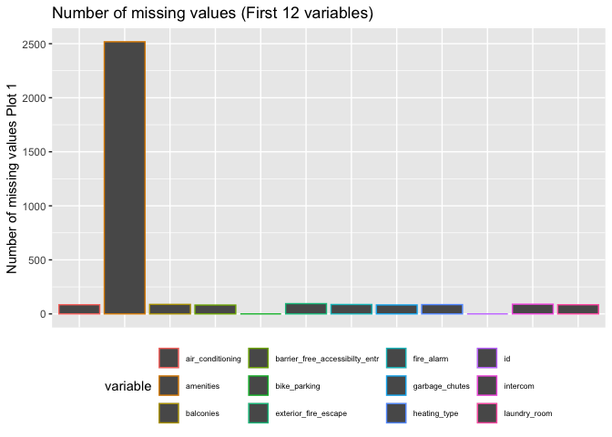
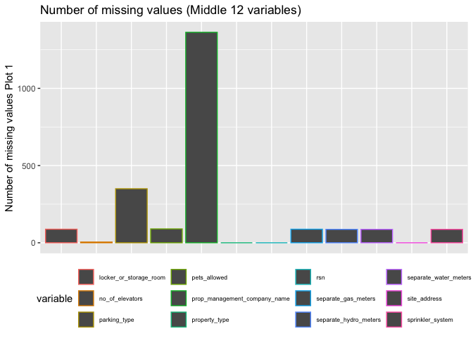
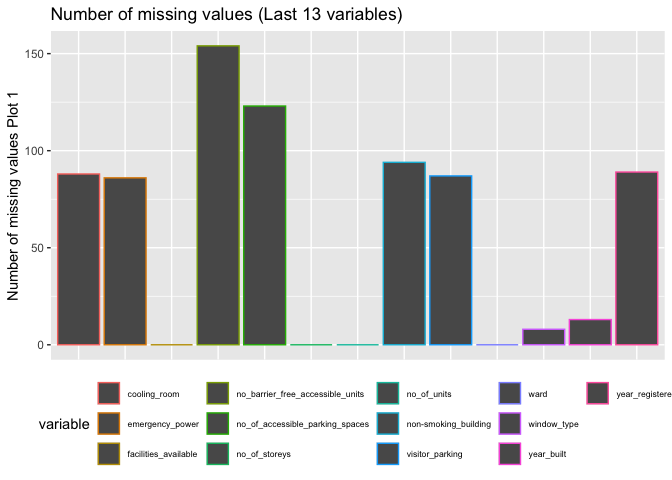
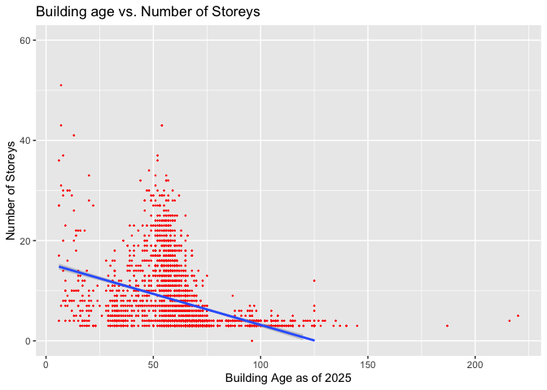
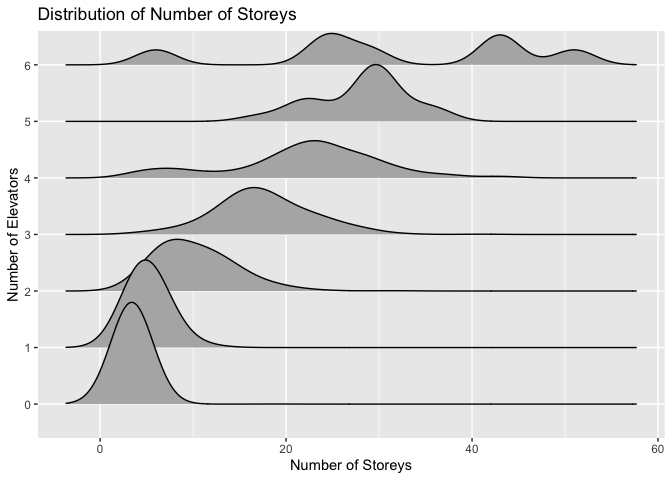

Mini Data-Analysis Deliverable 1
================

# Welcome to your (maybe) first-ever data analysis project!

And hopefully the first of many. Let’s get started:

1.  Install the [`datateachr`](https://github.com/UBC-MDS/datateachr)
    package by typing the following into your **R terminal**:

<!-- -->

    install.packages("devtools")
    devtools::install_github("UBC-MDS/datateachr")

2.  Load the packages below.

``` r
library(datateachr)
library(tidyverse)
```

    ## ── Attaching core tidyverse packages ──────────────────────── tidyverse 2.0.0 ──
    ## ✔ dplyr     1.1.4     ✔ readr     2.1.5
    ## ✔ forcats   1.0.0     ✔ stringr   1.5.2
    ## ✔ ggplot2   4.0.0     ✔ tibble    3.3.0
    ## ✔ lubridate 1.9.4     ✔ tidyr     1.3.1
    ## ✔ purrr     1.1.0     
    ## ── Conflicts ────────────────────────────────────────── tidyverse_conflicts() ──
    ## ✖ dplyr::filter() masks stats::filter()
    ## ✖ dplyr::lag()    masks stats::lag()
    ## ℹ Use the conflicted package (<http://conflicted.r-lib.org/>) to force all conflicts to become errors

3.  Make a repository in the <https://github.com/stat545ubc-2024>
    Organization. You can do this by following the steps found on canvas
    in the entry called [MDA: Create a
    repository](https://canvas.ubc.ca/courses/158528/pages/mda-create-a-repository).
    One completed, your repository should automatically be listed as
    part of the stat545ubc-2024 Organization.

# Instructions

## For Both Milestones

- Each milestone has explicit tasks. Tasks that are more challenging
  will often be allocated more points.

- Each milestone will be also graded for reproducibility, cleanliness,
  and coherence of the overall Github submission.

- While the two milestones will be submitted as independent
  deliverables, the analysis itself is a continuum - think of it as two
  chapters to a story. Each chapter, or in this case, portion of your
  analysis, should be easily followed through by someone unfamiliar with
  the content.
  [Here](https://swcarpentry.github.io/r-novice-inflammation/06-best-practices-R.html)
  is a good resource for what constitutes “good code”. Learning good
  coding practices early in your career will save you hassle later on!

- The milestones will be equally weighted.

## For Milestone 1

**To complete this milestone**, edit [this very `.Rmd`
file](https://raw.githubusercontent.com/UBC-STAT/stat545.stat.ubc.ca/master/content/mini-project/mini-project-1.Rmd)
directly. Fill in the sections that are tagged with
`<!--- start your work below --->`.

**To submit this milestone**, make sure to knit this `.Rmd` file to an
`.md` file by changing the YAML output settings from
`output: html_document` to `output: github_document`. Commit and push
all of your work to the mini-analysis GitHub repository you made
earlier, and tag a release on GitHub. Then, submit a link to your tagged
release on canvas.

**Points**: This milestone is worth 36 points: 30 for your analysis, and
6 for overall reproducibility, cleanliness, and coherence of the Github
submission.

# Learning Objectives

By the end of this milestone, you should:

- Become familiar with your dataset of choosing
- Select 4 questions that you would like to answer with your data
- Generate a reproducible and clear report using R Markdown
- Become familiar with manipulating and summarizing your data in tibbles
  using `dplyr`, with a research question in mind.

# Task 1: Choose your favorite dataset

The `datateachr` package by Hayley Boyce and Jordan Bourak currently
composed of 7 semi-tidy datasets for educational purposes. Here is a
brief description of each dataset:

- *apt_buildings*: Acquired courtesy of The City of Toronto’s Open Data
  Portal. It currently has 3455 rows and 37 columns.

- *building_permits*: Acquired courtesy of The City of Vancouver’s Open
  Data Portal. It currently has 20680 rows and 14 columns.

- *cancer_sample*: Acquired courtesy of UCI Machine Learning Repository.
  It currently has 569 rows and 32 columns.

- *flow_sample*: Acquired courtesy of The Government of Canada’s
  Historical Hydrometric Database. It currently has 218 rows and 7
  columns.

- *parking_meters*: Acquired courtesy of The City of Vancouver’s Open
  Data Portal. It currently has 10032 rows and 22 columns.

- *steam_games*: Acquired courtesy of Kaggle. It currently has 40833
  rows and 21 columns.

- *vancouver_trees*: Acquired courtesy of The City of Vancouver’s Open
  Data Portal. It currently has 146611 rows and 20 columns.

**Things to keep in mind**

- We hope that this project will serve as practice for carrying our your
  own *independent* data analysis. Remember to comment your code, be
  explicit about what you are doing, and write notes in this markdown
  document when you feel that context is required. As you advance in the
  project, prompts and hints to do this will be diminished - it’ll be up
  to you!

- Before choosing a dataset, you should always keep in mind **your
  goal**, or in other ways, *what you wish to achieve with this data*.
  This mini data-analysis project focuses on *data wrangling*,
  *tidying*, and *visualization*. In short, it’s a way for you to get
  your feet wet with exploring data on your own.

And that is exactly the first thing that you will do!

1.1 **(1 point)** Out of the 7 datasets available in the `datateachr`
package, choose **4** that appeal to you based on their description.
Write your choices below:

**Note**: We encourage you to use the ones in the `datateachr` package,
but if you have a dataset that you’d really like to use, you can include
it here. But, please check with a member of the teaching team to see
whether the dataset is of appropriate complexity. Also, include a
**brief** description of the dataset here to help the teaching team
understand your data.

<!-------------------------- Start your work below ---------------------------->

1: *apt_buildings*  
2: *building_permits*  
3: *steam_games*  
4: *cancer_sample*

<!----------------------------------------------------------------------------->

1.2 **(6 points)** One way to narrowing down your selection is to
*explore* the datasets. Use your knowledge of dplyr to find out at least
*3* attributes about each of these datasets (an attribute is something
such as number of rows, variables, class type…). The goal here is to
have an idea of *what the data looks like*.

*Hint:* This is one of those times when you should think about the
cleanliness of your analysis. I added a single code chunk for you below,
but do you want to use more than one? Would you like to write more
comments outside of the code chunk?

<!-------------------------- Start your work below ---------------------------->

## Exploring the Dataset

### steam_games

``` r
#procure basic information
glimpse(steam_games)
```

    ## Rows: 40,833
    ## Columns: 21
    ## $ id                       <dbl> 1, 2, 3, 4, 5, 6, 7, 8, 9, 10, 11, 12, 13, 14…
    ## $ url                      <chr> "https://store.steampowered.com/app/379720/DO…
    ## $ types                    <chr> "app", "app", "app", "app", "app", "bundle", …
    ## $ name                     <chr> "DOOM", "PLAYERUNKNOWN'S BATTLEGROUNDS", "BAT…
    ## $ desc_snippet             <chr> "Now includes all three premium DLC packs (Un…
    ## $ recent_reviews           <chr> "Very Positive,(554),- 89% of the 554 user re…
    ## $ all_reviews              <chr> "Very Positive,(42,550),- 92% of the 42,550 u…
    ## $ release_date             <chr> "May 12, 2016", "Dec 21, 2017", "Apr 24, 2018…
    ## $ developer                <chr> "id Software", "PUBG Corporation", "Harebrain…
    ## $ publisher                <chr> "Bethesda Softworks,Bethesda Softworks", "PUB…
    ## $ popular_tags             <chr> "FPS,Gore,Action,Demons,Shooter,First-Person,…
    ## $ game_details             <chr> "Single-player,Multi-player,Co-op,Steam Achie…
    ## $ languages                <chr> "English,French,Italian,German,Spanish - Spai…
    ## $ achievements             <dbl> 54, 37, 128, NA, NA, NA, 51, 55, 34, 43, 72, …
    ## $ genre                    <chr> "Action", "Action,Adventure,Massively Multipl…
    ## $ game_description         <chr> "About This Game Developed by id software, th…
    ## $ mature_content           <chr> NA, "Mature Content Description  The develope…
    ## $ minimum_requirements     <chr> "Minimum:,OS:,Windows 7/8.1/10 (64-bit versio…
    ## $ recommended_requirements <chr> "Recommended:,OS:,Windows 7/8.1/10 (64-bit ve…
    ## $ original_price           <dbl> 19.99, 29.99, 39.99, 44.99, 0.00, NA, 59.99, …
    ## $ discount_price           <dbl> 14.99, NA, NA, NA, NA, 35.18, 70.42, 17.58, N…

By inspection, the dataset *steam_games* contains 40833 observations and
21 variables of interest. Among the variables, 4 are numerical (*id*,
*original_price*, *discount_price*, *achievements*), and the remaining
are all encoded as strings. There are also 5 non-numeric variables that
contain some numerical information: *release_date*,
*minimum_requirements*, *recommended_requirements*, *recent_reviews*,
*all_reviews*.

Moreover, by inspection, at least some (*achievements*,
*mature_content*, *discount_price*, *original_Price*) of the variables
takes on a value of NA for certain observations.

``` r
#Segregating the observations with NA
steam_games_without_NA <- filter(steam_games, complete.cases(steam_games))
glimpse(steam_games_without_NA)
```

    ## Rows: 81
    ## Columns: 21
    ## $ id                       <dbl> 7, 38, 76, 95, 154, 161, 225, 255, 272, 281, …
    ## $ url                      <chr> "https://store.steampowered.com/app/601150/De…
    ## $ types                    <chr> "app", "app", "app", "app", "app", "app", "ap…
    ## $ name                     <chr> "Devil May Cry 5", "Life is Strange 2", "Call…
    ## $ desc_snippet             <chr> "The ultimate Devil Hunter is back in style, …
    ## $ recent_reviews           <chr> "Very Positive,(408),- 87% of the 408 user re…
    ## $ all_reviews              <chr> "Very Positive,(9,645),- 92% of the 9,645 use…
    ## $ release_date             <chr> "Mar 7, 2019", "Sep 26, 2018", "Nov 2, 2017",…
    ## $ developer                <chr> "CAPCOM Co., Ltd.", "DONTNOD Entertainment", …
    ## $ publisher                <chr> "CAPCOM Co., Ltd.,CAPCOM Co., Ltd.", "Square …
    ## $ popular_tags             <chr> "Action,Hack and Slash,Great Soundtrack,Demon…
    ## $ game_details             <chr> "Single-player,Online Multi-Player,Online Co-…
    ## $ languages                <chr> "English,French,Italian,German,Spanish - Spai…
    ## $ achievements             <dbl> 51, 46, 35, 44, 56, 99, 132, 55, 70, 43, 25, …
    ## $ genre                    <chr> "Action", "Adventure", "Action", "Indie,Strat…
    ## $ game_description         <chr> "About This Game The Devil you know returns i…
    ## $ mature_content           <chr> "Mature Content Description  The developers d…
    ## $ minimum_requirements     <chr> "Minimum:,OS:,WINDOWS® 7, 8.1, 10 (64-BIT Req…
    ## $ recommended_requirements <chr> "Recommended:,OS:,WINDOWS® 7, 8.1, 10 (64-BIT…
    ## $ original_price           <dbl> 59.99, 7.99, 1.02, 39.99, 19.99, 0.00, 24.99,…
    ## $ discount_price           <dbl> 70.42, 39.95, 906.48, 13.59, 28.48, 89.06, 21…

By filtering for only incomplete observations, we see that the dataset
only contains 81 games with full data and no missing values, this is not
a large number

``` r
#Identify number of NAs in each column
colSums(is.na(steam_games))
```

    ##                       id                      url                    types 
    ##                        0                        0                        2 
    ##                     name             desc_snippet           recent_reviews 
    ##                        2                       41                    35317 
    ##              all_reviews             release_date                developer 
    ##                     9553                        2                      342 
    ##                publisher             popular_tags             game_details 
    ##                     5100                      135                      520 
    ##                languages             achievements                    genre 
    ##                       36                    28639                      438 
    ##         game_description           mature_content     minimum_requirements 
    ##                      103                    35126                    16953 
    ## recommended_requirements           original_price           discount_price 
    ##                    16947                     5353                    26290

``` r
#Find observations with missing names
steam_games_no_names <- filter(steam_games, is.na(name))
glimpse(steam_games_no_names)
```

    ## Rows: 2
    ## Columns: 21
    ## $ id                       <dbl> 705, 35170
    ## $ url                      <chr> "https://store.steampowered.com/", "https://s…
    ## $ types                    <chr> NA, NA
    ## $ name                     <chr> NA, NA
    ## $ desc_snippet             <chr> NA, NA
    ## $ recent_reviews           <chr> NA, NA
    ## $ all_reviews              <chr> NA, NA
    ## $ release_date             <chr> NA, NA
    ## $ developer                <chr> NA, NA
    ## $ publisher                <chr> NA, NA
    ## $ popular_tags             <chr> NA, NA
    ## $ game_details             <chr> NA, NA
    ## $ languages                <chr> NA, NA
    ## $ achievements             <dbl> NA, NA
    ## $ genre                    <chr> NA, NA
    ## $ game_description         <chr> NA, NA
    ## $ mature_content           <chr> NA, NA
    ## $ minimum_requirements     <chr> NA, NA
    ## $ recommended_requirements <chr> NA, NA
    ## $ original_price           <dbl> 29.99, NA
    ## $ discount_price           <dbl> 23.99, NA

From the above output, it is clear that the vast majority (around 35126)
of the total 40833 observations have missing values for the
*mature_content* and *recent_reviews*. This may not be unreasonable as
certain games may contain no mature content and may also have no recent
reviews.

A minority (around 16953) of the observations have no information on
*minimum_requirements* or *recommended_requirements*.

Curiously, there are 2 games that has a missing value for the *name*
variable. Upon a quick inspection of these two rows, it appears from
their *url* that these observations are for the general steam store page
and steam gift cards and are not games per se.

### cancer_sample

``` r
#procure basic information
glimpse(cancer_sample)
```

    ## Rows: 569
    ## Columns: 32
    ## $ ID                      <dbl> 842302, 842517, 84300903, 84348301, 84358402, …
    ## $ diagnosis               <chr> "M", "M", "M", "M", "M", "M", "M", "M", "M", "…
    ## $ radius_mean             <dbl> 17.990, 20.570, 19.690, 11.420, 20.290, 12.450…
    ## $ texture_mean            <dbl> 10.38, 17.77, 21.25, 20.38, 14.34, 15.70, 19.9…
    ## $ perimeter_mean          <dbl> 122.80, 132.90, 130.00, 77.58, 135.10, 82.57, …
    ## $ area_mean               <dbl> 1001.0, 1326.0, 1203.0, 386.1, 1297.0, 477.1, …
    ## $ smoothness_mean         <dbl> 0.11840, 0.08474, 0.10960, 0.14250, 0.10030, 0…
    ## $ compactness_mean        <dbl> 0.27760, 0.07864, 0.15990, 0.28390, 0.13280, 0…
    ## $ concavity_mean          <dbl> 0.30010, 0.08690, 0.19740, 0.24140, 0.19800, 0…
    ## $ concave_points_mean     <dbl> 0.14710, 0.07017, 0.12790, 0.10520, 0.10430, 0…
    ## $ symmetry_mean           <dbl> 0.2419, 0.1812, 0.2069, 0.2597, 0.1809, 0.2087…
    ## $ fractal_dimension_mean  <dbl> 0.07871, 0.05667, 0.05999, 0.09744, 0.05883, 0…
    ## $ radius_se               <dbl> 1.0950, 0.5435, 0.7456, 0.4956, 0.7572, 0.3345…
    ## $ texture_se              <dbl> 0.9053, 0.7339, 0.7869, 1.1560, 0.7813, 0.8902…
    ## $ perimeter_se            <dbl> 8.589, 3.398, 4.585, 3.445, 5.438, 2.217, 3.18…
    ## $ area_se                 <dbl> 153.40, 74.08, 94.03, 27.23, 94.44, 27.19, 53.…
    ## $ smoothness_se           <dbl> 0.006399, 0.005225, 0.006150, 0.009110, 0.0114…
    ## $ compactness_se          <dbl> 0.049040, 0.013080, 0.040060, 0.074580, 0.0246…
    ## $ concavity_se            <dbl> 0.05373, 0.01860, 0.03832, 0.05661, 0.05688, 0…
    ## $ concave_points_se       <dbl> 0.015870, 0.013400, 0.020580, 0.018670, 0.0188…
    ## $ symmetry_se             <dbl> 0.03003, 0.01389, 0.02250, 0.05963, 0.01756, 0…
    ## $ fractal_dimension_se    <dbl> 0.006193, 0.003532, 0.004571, 0.009208, 0.0051…
    ## $ radius_worst            <dbl> 25.38, 24.99, 23.57, 14.91, 22.54, 15.47, 22.8…
    ## $ texture_worst           <dbl> 17.33, 23.41, 25.53, 26.50, 16.67, 23.75, 27.6…
    ## $ perimeter_worst         <dbl> 184.60, 158.80, 152.50, 98.87, 152.20, 103.40,…
    ## $ area_worst              <dbl> 2019.0, 1956.0, 1709.0, 567.7, 1575.0, 741.6, …
    ## $ smoothness_worst        <dbl> 0.1622, 0.1238, 0.1444, 0.2098, 0.1374, 0.1791…
    ## $ compactness_worst       <dbl> 0.6656, 0.1866, 0.4245, 0.8663, 0.2050, 0.5249…
    ## $ concavity_worst         <dbl> 0.71190, 0.24160, 0.45040, 0.68690, 0.40000, 0…
    ## $ concave_points_worst    <dbl> 0.26540, 0.18600, 0.24300, 0.25750, 0.16250, 0…
    ## $ symmetry_worst          <dbl> 0.4601, 0.2750, 0.3613, 0.6638, 0.2364, 0.3985…
    ## $ fractal_dimension_worst <dbl> 0.11890, 0.08902, 0.08758, 0.17300, 0.07678, 0…

By inspection, the dataset *cancer_sample* contains 569 observations and
32 variables of interest. Among the variables, 31 are numerical. This
gives us 1 non-numeric variables.

The only non-numerical variable in question is *diagnosis*.

By inspection, there does not appear to be observations with missing
values.

``` r
#Verify the completeness of data
number_of_complete_cases <- nrow(filter(cancer_sample, complete.cases(cancer_sample)))
number_of_complete_cases == nrow(cancer_sample)
```

    ## [1] TRUE

Some R code enable us to verify that the *cancer_sample* have 0 rows
with missing values.

``` r
#Getting the possible outcomes for diagnosis
unique(cancer_sample$diagnosis)
```

    ## [1] "M" "B"

``` r
#Checking the distribution
counts = count(cancer_sample, diagnosis)
counts
```

    ## # A tibble: 2 × 2
    ##   diagnosis     n
    ##   <chr>     <int>
    ## 1 B           357
    ## 2 M           212

The only non-numerical variable in the dataset, *diagnosis* is
categorical with 2 categories, “M” and “B”. These are in reference to
the neoplasm being malignant or benign.

There are a total of 357 benign cases and a total of 212 malignant
cases.

### apt_buildings

``` r
#procure basic information
glimpse(apt_buildings)
```

    ## Rows: 3,455
    ## Columns: 37
    ## $ id                               <dbl> 10359, 10360, 10361, 10362, 10363, 10…
    ## $ air_conditioning                 <chr> "NONE", "NONE", "NONE", "NONE", "NONE…
    ## $ amenities                        <chr> "Outdoor rec facilities", "Outdoor po…
    ## $ balconies                        <chr> "YES", "YES", "YES", "YES", "NO", "NO…
    ## $ barrier_free_accessibilty_entr   <chr> "YES", "NO", "NO", "YES", "NO", "NO",…
    ## $ bike_parking                     <chr> "0 indoor parking spots and 10 outdoo…
    ## $ exterior_fire_escape             <chr> "NO", "NO", "NO", "YES", "NO", NA, "N…
    ## $ fire_alarm                       <chr> "YES", "YES", "YES", "YES", "YES", "Y…
    ## $ garbage_chutes                   <chr> "YES", "YES", "NO", "NO", "NO", "NO",…
    ## $ heating_type                     <chr> "HOT WATER", "HOT WATER", "HOT WATER"…
    ## $ intercom                         <chr> "YES", "YES", "YES", "YES", "YES", "Y…
    ## $ laundry_room                     <chr> "YES", "YES", "YES", "YES", "YES", "Y…
    ## $ locker_or_storage_room           <chr> "NO", "YES", "YES", "YES", "NO", "YES…
    ## $ no_of_elevators                  <dbl> 3, 3, 0, 1, 0, 0, 0, 2, 4, 2, 0, 2, 2…
    ## $ parking_type                     <chr> "Underground Garage , Garage accessib…
    ## $ pets_allowed                     <chr> "YES", "YES", "YES", "YES", "YES", "Y…
    ## $ prop_management_company_name     <chr> NA, "SCHICKEDANZ BROS. PROPERTIES", N…
    ## $ property_type                    <chr> "PRIVATE", "PRIVATE", "PRIVATE", "PRI…
    ## $ rsn                              <dbl> 4154812, 4154815, 4155295, 4155309, 4…
    ## $ separate_gas_meters              <chr> "NO", "NO", "NO", "NO", "NO", "NO", "…
    ## $ separate_hydro_meters            <chr> "YES", "YES", "YES", "YES", "YES", "Y…
    ## $ separate_water_meters            <chr> "NO", "NO", "NO", "NO", "NO", "NO", "…
    ## $ site_address                     <chr> "65  FOREST MANOR RD", "70  CLIPPER R…
    ## $ sprinkler_system                 <chr> "YES", "YES", "NO", "YES", "NO", "NO"…
    ## $ visitor_parking                  <chr> "PAID", "FREE", "UNAVAILABLE", "UNAVA…
    ## $ ward                             <chr> "17", "17", "03", "03", "02", "02", "…
    ## $ window_type                      <chr> "DOUBLE PANE", "DOUBLE PANE", "DOUBLE…
    ## $ year_built                       <dbl> 1967, 1970, 1927, 1959, 1943, 1952, 1…
    ## $ year_registered                  <dbl> 2017, 2017, 2017, 2017, 2017, NA, 201…
    ## $ no_of_storeys                    <dbl> 17, 14, 4, 5, 4, 4, 4, 7, 32, 4, 4, 7…
    ## $ emergency_power                  <chr> "NO", "YES", "NO", "NO", "NO", "NO", …
    ## $ `non-smoking_building`           <chr> "YES", "NO", "YES", "YES", "YES", "NO…
    ## $ no_of_units                      <dbl> 218, 206, 34, 42, 25, 34, 14, 105, 57…
    ## $ no_of_accessible_parking_spaces  <dbl> 8, 10, 20, 42, 12, 0, 5, 1, 1, 6, 12,…
    ## $ facilities_available             <chr> "Recycling bins", "Green Bin / Organi…
    ## $ cooling_room                     <chr> "NO", "NO", "NO", "NO", "NO", "NO", "…
    ## $ no_barrier_free_accessible_units <dbl> 2, 0, 0, 42, 0, NA, 14, 0, 0, 1, 25, …

By inspection, the dataset *apt_buildings* contains 3455 observations
and 37 variables of interest. Among the variables, 9 are numerical. This
gives us 28 non-numeric variables.

Moreover, most of the non-numeric variables are categorical and appears
to only take on the values of “YES” and “NO”. These include the
variables *sprinkler_system*, *separate_water_meters*, *cooling_room*,
and several others. There are also some that do not take on strict
categories, such as *site_address*. It is unclear at first glance
whether *facilities_available* and *amentities* are categorical or
descriptive.

There also appear to be some observations with missing values.

``` r
#Segregating the observations with NA
apt_buildings_without_NA <- filter(apt_buildings, complete.cases(apt_buildings))
glimpse(apt_buildings_without_NA)
```

    ## Rows: 532
    ## Columns: 37
    ## $ id                               <dbl> 10360, 10366, 10373, 10386, 10388, 10…
    ## $ air_conditioning                 <chr> "NONE", "CENTRAL AIR", "NONE", "NONE"…
    ## $ amenities                        <chr> "Outdoor pool", "Indoor pool , Indoor…
    ## $ balconies                        <chr> "YES", "YES", "YES", "YES", "NO", "YE…
    ## $ barrier_free_accessibilty_entr   <chr> "NO", "NO", "NO", "NO", "YES", "YES",…
    ## $ bike_parking                     <chr> "0 indoor parking spots and 34 outdoo…
    ## $ exterior_fire_escape             <chr> "NO", "NO", "NO", "NO", "NO", "NO", "…
    ## $ fire_alarm                       <chr> "YES", "YES", "YES", "YES", "YES", "Y…
    ## $ garbage_chutes                   <chr> "YES", "YES", "NO", "YES", "NO", "YES…
    ## $ heating_type                     <chr> "HOT WATER", "HOT WATER", "HOT WATER"…
    ## $ intercom                         <chr> "YES", "YES", "YES", "YES", "YES", "Y…
    ## $ laundry_room                     <chr> "YES", "YES", "YES", "YES", "YES", "Y…
    ## $ locker_or_storage_room           <chr> "YES", "YES", "YES", "NO", "YES", "NO…
    ## $ no_of_elevators                  <dbl> 3, 2, 2, 2, 2, 2, 3, 3, 2, 4, 3, 2, 0…
    ## $ parking_type                     <chr> "Underground Garage , Garage accessib…
    ## $ pets_allowed                     <chr> "YES", "YES", "YES", "YES", "YES", "Y…
    ## $ prop_management_company_name     <chr> "SCHICKEDANZ BROS. PROPERTIES", "PRIN…
    ## $ property_type                    <chr> "PRIVATE", "PRIVATE", "PRIVATE", "PRI…
    ## $ rsn                              <dbl> 4154815, 4155928, 4152694, 4155710, 4…
    ## $ separate_gas_meters              <chr> "NO", "NO", "NO", "NO", "NO", "NO", "…
    ## $ separate_hydro_meters            <chr> "YES", "YES", "YES", "YES", "NO", "NO…
    ## $ separate_water_meters            <chr> "NO", "NO", "NO", "NO", "NO", "NO", "…
    ## $ site_address                     <chr> "70  CLIPPER RD", "41  WARRENDER AVE"…
    ## $ sprinkler_system                 <chr> "YES", "YES", "YES", "YES", "YES", "Y…
    ## $ visitor_parking                  <chr> "FREE", "FREE", "FREE", "UNAVAILABLE"…
    ## $ ward                             <chr> "17", "02", "21", "09", "05", "20", "…
    ## $ window_type                      <chr> "DOUBLE PANE", "SINGLE PANE", "DOUBLE…
    ## $ year_built                       <dbl> 1970, 1971, 1960, 2005, 1969, 2011, 1…
    ## $ year_registered                  <dbl> 2017, 2017, 2017, 2017, 2017, 2017, 2…
    ## $ no_of_storeys                    <dbl> 14, 7, 7, 9, 20, 10, 21, 22, 10, 25, …
    ## $ emergency_power                  <chr> "YES", "YES", "YES", "YES", "YES", "Y…
    ## $ `non-smoking_building`           <chr> "NO", "YES", "NO", "YES", "NO", "YES"…
    ## $ no_of_units                      <dbl> 206, 105, 71, 116, 161, 153, 237, 220…
    ## $ no_of_accessible_parking_spaces  <dbl> 10, 1, 2, 0, 1, 3, 1, 61, 1, 0, 0, 1,…
    ## $ facilities_available             <chr> "Green Bin / Organics", "Green Bin / …
    ## $ cooling_room                     <chr> "NO", "NO", "NO", "NO", "NO", "YES", …
    ## $ no_barrier_free_accessible_units <dbl> 0, 0, 0, 0, 1, 2, 0, 220, 0, 2, 1, 0,…

By filtering for only incomplete observations, we see that the dataset
only contains 532 games with full data and no missing values.

``` r
#Unique values of amenities
unique(apt_buildings$amenities)
```

    ##  [1] "Outdoor rec facilities"                                                                                         
    ##  [2] "Outdoor pool"                                                                                                   
    ##  [3] NA                                                                                                               
    ##  [4] "Indoor pool , Indoor recreation room , Indoor exercise room"                                                    
    ##  [5] "Indoor recreation room"                                                                                         
    ##  [6] "Indoor pool , Indoor recreation room , Indoor exercise room , Sauna"                                            
    ##  [7] "Indoor exercise room"                                                                                           
    ##  [8] "Indoor recreation room , Indoor exercise room , Child play area"                                                
    ##  [9] "Outdoor pool , Indoor recreation room"                                                                          
    ## [10] "Outdoor pool , Outdoor rec facilities , Child play area"                                                        
    ## [11] "Indoor pool , Indoor recreation room , Outdoor rec facilities , Indoor exercise room , Sauna"                   
    ## [12] "Indoor pool , Sauna"                                                                                            
    ## [13] "Indoor recreation room , Outdoor rec facilities , Child play area"                                              
    ## [14] "Outdoor rec facilities , Child play area"                                                                       
    ## [15] "Outdoor pool , Outdoor rec facilities"                                                                          
    ## [16] "Outdoor pool , Indoor recreation room , Outdoor rec facilities"                                                 
    ## [17] "Outdoor pool , Indoor recreation room , Outdoor rec facilities , Indoor exercise room"                          
    ## [18] "Indoor recreation room , Outdoor rec facilities"                                                                
    ## [19] "Indoor recreation room , Outdoor rec facilities , Indoor exercise room"                                         
    ## [20] "Indoor recreation room , Indoor exercise room"                                                                  
    ## [21] "Indoor recreation room , Child play area"                                                                       
    ## [22] "Outdoor pool , Indoor exercise room"                                                                            
    ## [23] "Child play area"                                                                                                
    ## [24] "Outdoor pool , Indoor exercise room , Sauna"                                                                    
    ## [25] "Outdoor pool , Child play area"                                                                                 
    ## [26] "Outdoor pool , Outdoor rec facilities , Sauna"                                                                  
    ## [27] "Outdoor pool , Indoor recreation room , Outdoor rec facilities , Indoor exercise room , Child play area , Sauna"
    ## [28] "Indoor exercise room , Child play area"                                                                         
    ## [29] "Outdoor pool , Indoor exercise room , Child play area"                                                          
    ## [30] "Outdoor pool , Indoor pool , Indoor recreation room , Indoor exercise room , Sauna"                             
    ## [31] "Outdoor pool , Indoor pool"                                                                                     
    ## [32] "Indoor pool , Child play area , Sauna"                                                                          
    ## [33] "Outdoor pool , Sauna"                                                                                           
    ## [34] "Indoor pool , Indoor exercise room , Sauna"                                                                     
    ## [35] "Indoor exercise room , Sauna"                                                                                   
    ## [36] "Outdoor pool , Indoor recreation room , Indoor exercise room , Sauna"                                           
    ## [37] "Indoor recreation room , Outdoor rec facilities , Indoor exercise room , Sauna"                                 
    ## [38] "Indoor pool , Child play area"                                                                                  
    ## [39] "Indoor recreation room , Indoor exercise room , Sauna"                                                          
    ## [40] "Child play area , Sauna"                                                                                        
    ## [41] "Indoor pool , Indoor recreation room , Outdoor rec facilities , Indoor exercise room"                           
    ## [42] "Indoor pool"                                                                                                    
    ## [43] "Outdoor pool , Indoor recreation room , Outdoor rec facilities , Indoor exercise room , Child play area"        
    ## [44] "Indoor recreation room , Child play area , Sauna"                                                               
    ## [45] "Indoor pool , Outdoor rec facilities , Sauna"                                                                   
    ## [46] "Outdoor pool , Outdoor rec facilities , Indoor exercise room"                                                   
    ## [47] "Indoor recreation room , Outdoor rec facilities , Indoor exercise room , Child play area"                       
    ## [48] "Outdoor pool , Indoor recreation room , Outdoor rec facilities , Indoor exercise room , Sauna"                  
    ## [49] "Indoor pool , Indoor recreation room , Outdoor rec facilities , Indoor exercise room , Child play area , Sauna" 
    ## [50] "Outdoor pool , Indoor recreation room , Indoor exercise room , Child play area"                                 
    ## [51] "Indoor pool , Indoor recreation room"                                                                           
    ## [52] "Outdoor rec facilities , Indoor exercise room"                                                                  
    ## [53] "Outdoor pool , Indoor recreation room , Outdoor rec facilities , Child play area"                               
    ## [54] "Indoor pool , Outdoor rec facilities"                                                                           
    ## [55] "Indoor recreation room , Outdoor rec facilities , Indoor exercise room , Child play area , Sauna"               
    ## [56] "Outdoor rec facilities , Sauna"                                                                                 
    ## [57] "Outdoor pool , Indoor recreation room , Child play area"                                                        
    ## [58] "Outdoor pool , Indoor recreation room , Outdoor rec facilities , Child play area , Sauna"                       
    ## [59] "Indoor pool , Indoor exercise room"                                                                             
    ## [60] "Sauna"                                                                                                          
    ## [61] "Indoor pool , Indoor recreation room , Sauna"                                                                   
    ## [62] "Outdoor pool , Indoor recreation room , Sauna"                                                                  
    ## [63] "Indoor exercise room , Child play area , Sauna"                                                                 
    ## [64] "Indoor pool , Indoor recreation room , Indoor exercise room , Child play area , Sauna"                          
    ## [65] "Outdoor pool , Outdoor rec facilities , Indoor exercise room , Sauna"                                           
    ## [66] "Indoor pool , Indoor recreation room , Outdoor rec facilities , Indoor exercise room , Child play area"         
    ## [67] "Outdoor pool , Indoor recreation room , Indoor exercise room"                                                   
    ## [68] "Indoor pool , Outdoor rec facilities , Indoor exercise room , Sauna"                                            
    ## [69] "Indoor pool , Indoor recreation room , Outdoor rec facilities , Sauna"                                          
    ## [70] "Outdoor rec facilities , Indoor exercise room , Child play area , Sauna"

``` r
amentities_types = length(unique(apt_buildings$amenities))
```

It seems that for the *amenities* variable, it can take on a total of 70
possible values, including NA. By visually inspecting the output of the
code above, it appears that the values of this variable consist of tuple
of several unique strings, including *In/Outdoor rec facilities*,
*In/Outdoor pool*, *In/Outdoor exercise room*, *Child play area*, and
*Sauna*.

### building_permits

``` r
#procure basic information
glimpse(building_permits)
```

    ## Rows: 20,680
    ## Columns: 14
    ## $ permit_number               <chr> "BP-2016-02248", "BU468090", "DB-2016-0445…
    ## $ issue_date                  <date> 2017-02-01, 2017-02-01, 2017-02-01, 2017-…
    ## $ project_value               <dbl> 0, 0, 35000, 15000, 181178, 0, 15000, 0, 6…
    ## $ type_of_work                <chr> "Salvage and Abatement", "New Building", "…
    ## $ address                     <chr> "4378 W 9TH AVENUE, Vancouver, BC V6R 2C7"…
    ## $ project_description         <chr> NA, NA, NA, NA, NA, NA, NA, NA, NA, NA, NA…
    ## $ building_contractor         <chr> NA, NA, NA, "Mercury Contracting Ltd", "08…
    ## $ building_contractor_address <chr> NA, NA, NA, "88 W PENDER ST  \r\nUnit 2069…
    ## $ applicant                   <chr> "Raffaele & Associates DBA: Raffaele and A…
    ## $ applicant_address           <chr> "2642 East Hastings\r\nVancouver, BC  V5K …
    ## $ property_use                <chr> "Dwelling Uses", "Dwelling Uses", "Dwellin…
    ## $ specific_use_category       <chr> "One-Family Dwelling", "Multiple Dwelling"…
    ## $ year                        <dbl> 2017, 2017, 2017, 2017, 2017, 2017, 2017, …
    ## $ bi_id                       <dbl> 524, 535, 539, 541, 543, 546, 547, 548, 54…

By inspection, the dataset *building_permits* contains 20680
observations and 14 variables of interest. Among the variables, 3 are
numerical. This gives us 11 non-numeric variables.

In the output above, the variables *property_use*,
*specific_use_category*, and *type_of_work* appears to be categorical
whilst the remaining non-numeric variables seem to be descriptive and
does not take on finitely many categories.

Moreover, there seems to be a large number of missing values surrounding
*project_description*.

``` r
#Counting the number of NAs in project description
project_desc_NA <- sum(sapply(building_permits$project_description, is.na))

#Finding the total number of full observations
building_permits_without_NA <- filter(building_permits, complete.cases(building_permits))
glimpse(building_permits_without_NA)
```

    ## Rows: 6,402
    ## Columns: 14
    ## $ permit_number               <chr> "DB-2019-04755", "DB-2019-04756", "BP-2019…
    ## $ issue_date                  <date> 2020-03-04, 2020-03-04, 2020-03-05, 2020-…
    ## $ project_value               <dbl> 997565.0, 15000.0, 0.0, 8000.0, 8000.0, 67…
    ## $ type_of_work                <chr> "New Building", "Demolition / Deconstructi…
    ## $ address                     <chr> "2251 BONNYVALE AVENUE, Vancouver, BC V5P …
    ## $ project_description         <chr> "Low Density Housing - New Building - 2 ST…
    ## $ building_contractor         <chr> "Sian Group Investments Inc", "Kingsman Ex…
    ## $ building_contractor_address <chr> "2177 BONACCORD DRIVE  \r\nVancouver, BC  …
    ## $ applicant                   <chr> "Mukhtiar Sian DBA: Sian Group Investments…
    ## $ applicant_address           <chr> "2177 Bonaccord Dr\r\nVancouver, BC  V5P 2…
    ## $ property_use                <chr> "Dwelling Uses", "Dwelling Uses", "Dwellin…
    ## $ specific_use_category       <chr> "Two-Family Dwelling w/Secondary Suite", "…
    ## $ year                        <dbl> 2020, 2020, 2020, 2020, 2020, 2020, 2020, …
    ## $ bi_id                       <dbl> 20005, 20006, 20017, 20023, 20025, 20032, …

``` r
#Finding the total number of full observations, ignoring project_description
building_permits_without_NA_no_desc <- filter(building_permits[-6], complete.cases(building_permits[-6]))
glimpse(building_permits_without_NA_no_desc)
```

    ## Rows: 9,168
    ## Columns: 13
    ## $ permit_number               <chr> "DB-2017-00131", "DB452250", "BP-2016-0369…
    ## $ issue_date                  <date> 2017-02-01, 2017-02-01, 2017-02-02, 2017-…
    ## $ project_value               <dbl> 15000, 181178, 25000, 44000, 200000, 10433…
    ## $ type_of_work                <chr> "Addition / Alteration", "New Building", "…
    ## $ address                     <chr> "88 W PENDER STREET, Vancouver, BC V6B 6N9…
    ## $ building_contractor         <chr> "Mercury Contracting Ltd", "0820163 BC Ltd…
    ## $ building_contractor_address <chr> "88 W PENDER ST  \r\nUnit 2069\r\nVancouve…
    ## $ applicant                   <chr> "Aaron Vaughan DBA: Mercury Contracting", …
    ## $ applicant_address           <chr> "2097-88 W Pender St\r\nVancouver, BC  V6B…
    ## $ property_use                <chr> "Office Uses,Retail Uses", "Dwelling Uses"…
    ## $ specific_use_category       <chr> "General Office, Retail Store", "Laneway H…
    ## $ year                        <dbl> 2017, 2017, 2017, 2017, 2017, 2017, 2017, …
    ## $ bi_id                       <dbl> 541, 543, 550, 562, 567, 587, 599, 635, 63…

In particular, 6734 observations do not have a *project_description*.
Overall, we have 6402 full observations.

If we ignore *project_description*, there are 9168 full observations.

``` r
#Inspecting projects of value zero
building_permits_value_0 = filter(building_permits, project_value == 0 | is.na(project_value))
glimpse(building_permits_value_0)
```

    ## Rows: 3,270
    ## Columns: 14
    ## $ permit_number               <chr> "BP-2016-02248", "BU468090", "BP-2016-0145…
    ## $ issue_date                  <date> 2017-02-01, 2017-02-01, 2017-02-02, 2017-…
    ## $ project_value               <dbl> 0, 0, 0, 0, 0, 0, 0, 0, 0, 0, 0, 0, 0, 0, …
    ## $ type_of_work                <chr> "Salvage and Abatement", "New Building", "…
    ## $ address                     <chr> "4378 W 9TH AVENUE, Vancouver, BC V6R 2C7"…
    ## $ project_description         <chr> NA, NA, NA, NA, NA, NA, NA, NA, NA, NA, NA…
    ## $ building_contractor         <chr> NA, NA, NA, NA, NA, "Sodhi Development Ltd…
    ## $ building_contractor_address <chr> NA, NA, NA, NA, NA, "8179 MAIN ST  \r\nVan…
    ## $ applicant                   <chr> "Raffaele & Associates DBA: Raffaele and A…
    ## $ applicant_address           <chr> "2642 East Hastings\r\nVancouver, BC  V5K …
    ## $ property_use                <chr> "Dwelling Uses", "Dwelling Uses", "Dwellin…
    ## $ specific_use_category       <chr> "One-Family Dwelling", "Multiple Dwelling"…
    ## $ year                        <dbl> 2017, 2017, 2017, 2017, 2017, 2017, 2017, …
    ## $ bi_id                       <dbl> 524, 535, 546, 548, 597, 599, 600, 605, 60…

``` r
#Identifying the type_of_work for such projects
unique(building_permits_value_0$type_of_work)
```

    ## [1] "Salvage and Abatement"          "New Building"                  
    ## [3] "Addition / Alteration"          "Demolition / Deconstruction"   
    ## [5] "Temporary Building / Structure"

``` r
counts = count(building_permits_value_0, type_of_work)
counts
```

    ## # A tibble: 5 × 2
    ##   type_of_work                       n
    ##   <chr>                          <int>
    ## 1 Addition / Alteration            292
    ## 2 Demolition / Deconstruction       26
    ## 3 New Building                     229
    ## 4 Salvage and Abatement           2721
    ## 5 Temporary Building / Structure     2

Within this dataset, we also have 3270 projects with a value of 0 or NA.
This may be expected for salvage and demolition operations.

Based on the code output above, there are 5 types of work for such type
of projects. Among these are 229 instances of new building.

<!----------------------------------------------------------------------------->

1.3 **(1 point)** Now that you’ve explored the 4 datasets that you were
initially most interested in, let’s narrow it down to 1. What lead you
to choose this one? Briefly explain your choice below.

<!-------------------------- Start your work below ---------------------------->

I will be using the **apt_buildings** dataset, as this dataset contains
a relatively large number of column and include a good mix of both
categorical and numerical variables, percent being numerical. This is
unlike **steam_games** or **cancer_sample** which leans heavily in of
the two types. **building_permits**, on the other hand, gives a
relatively small number of variables to work with.

<!----------------------------------------------------------------------------->

1.4 **(2 points)** Time for a final decision! Going back to the
beginning, it’s important to have an *end goal* in mind. For example, if
I had chosen the `titanic` dataset for my project, I might’ve wanted to
explore the relationship between survival and other variables. Try to
think of 1 research question that you would want to answer with your
dataset. Note it down below.

<!-------------------------- Start your work below ---------------------------->

> How is the building age of an apartment complex related to its
> amenities, parking spaces, and other features?

<!----------------------------------------------------------------------------->

# Important note

Read Tasks 2 and 3 *fully* before starting to complete either of them.
Probably also a good point to grab a coffee to get ready for the fun
part!

This project is semi-guided, but meant to be *independent*. For this
reason, you will complete tasks 2 and 3 below (under the **START HERE**
mark) as if you were writing your own exploratory data analysis report,
and this guidance never existed! Feel free to add a brief introduction
section to your project, format the document with markdown syntax as you
deem appropriate, and structure the analysis as you deem appropriate. If
you feel lost, you can find a sample data analysis
[here](https://www.kaggle.com/headsortails/tidy-titarnic) to have a
better idea. However, bear in mind that it is **just an example** and
you will not be required to have that level of complexity in your
project.

# Task 2: Exploring your dataset

If we rewind and go back to the learning objectives, you’ll see that by
the end of this deliverable, you should have formulated *4* research
questions about your data that you may want to answer during your
project. However, it may be handy to do some more exploration on your
dataset of choice before creating these questions - by looking at the
data, you may get more ideas. **Before you start this task, read all
instructions carefully until you reach START HERE under Task 3**.

2.1 **(12 points)** Complete *4 out of the following 8 exercises* to
dive deeper into your data. All datasets are different and therefore,
not all of these tasks may make sense for your data - which is why you
should only answer *4*.

Make sure that you’re using dplyr and ggplot2 rather than base R for
this task. Outside of this project, you may find that you prefer using
base R functions for certain tasks, and that’s just fine! But part of
this project is for you to practice the tools we learned in class, which
is dplyr and ggplot2.

1.  Plot the distribution of a numeric variable.
2.  Create a new variable based on other variables in your data (only if
    it makes sense)
3.  Investigate how many missing values there are per variable. Can you
    find a way to plot this?
4.  Explore the relationship between 2 variables in a plot.
5.  Filter observations in your data according to your own criteria.
    Think of what you’d like to explore - again, if this was the
    `titanic` dataset, I may want to narrow my search down to passengers
    born in a particular year…
6.  Use a boxplot to look at the frequency of different observations
    within a single variable. You can do this for more than one variable
    if you wish!
7.  Make a new tibble with a subset of your data, with variables and
    observations that you are interested in exploring.
8.  Use a density plot to explore any of your variables (that are
    suitable for this type of plot).

2.2 **(4 points)** For each of the 4 exercises that you complete,
provide a *brief explanation* of why you chose that exercise in relation
to your data (in other words, why does it make sense to do that?), and
sufficient comments for a reader to understand your reasoning and code.

<!-------------------------- Start your work below ---------------------------->

## 1 Introduction

In this mini data analysis, I will be using the dplyr and ggplot2 to
explore the various features of the *apt_buildings* data set. Through
visualizing and manipulating the this dataset, I aim to produce 4
possible research questions that may be addressed by this dataset.

### 1.1 Loading the Packages

As stated above, the ggplot2 and the tidyverse packages are required for
this analysis. They will be loaded here:

``` r
library(ggplot2)
library(tidyverse)
```

### 1.2 Data Overview

We will begin by producing a summary of the dataset using both the
built-in summary function and via the glimpse function from the
tidyverse package (this is just a short recapitulation of task 1)

``` r
glimpse(apt_buildings)
```

    ## Rows: 3,455
    ## Columns: 37
    ## $ id                               <dbl> 10359, 10360, 10361, 10362, 10363, 10…
    ## $ air_conditioning                 <chr> "NONE", "NONE", "NONE", "NONE", "NONE…
    ## $ amenities                        <chr> "Outdoor rec facilities", "Outdoor po…
    ## $ balconies                        <chr> "YES", "YES", "YES", "YES", "NO", "NO…
    ## $ barrier_free_accessibilty_entr   <chr> "YES", "NO", "NO", "YES", "NO", "NO",…
    ## $ bike_parking                     <chr> "0 indoor parking spots and 10 outdoo…
    ## $ exterior_fire_escape             <chr> "NO", "NO", "NO", "YES", "NO", NA, "N…
    ## $ fire_alarm                       <chr> "YES", "YES", "YES", "YES", "YES", "Y…
    ## $ garbage_chutes                   <chr> "YES", "YES", "NO", "NO", "NO", "NO",…
    ## $ heating_type                     <chr> "HOT WATER", "HOT WATER", "HOT WATER"…
    ## $ intercom                         <chr> "YES", "YES", "YES", "YES", "YES", "Y…
    ## $ laundry_room                     <chr> "YES", "YES", "YES", "YES", "YES", "Y…
    ## $ locker_or_storage_room           <chr> "NO", "YES", "YES", "YES", "NO", "YES…
    ## $ no_of_elevators                  <dbl> 3, 3, 0, 1, 0, 0, 0, 2, 4, 2, 0, 2, 2…
    ## $ parking_type                     <chr> "Underground Garage , Garage accessib…
    ## $ pets_allowed                     <chr> "YES", "YES", "YES", "YES", "YES", "Y…
    ## $ prop_management_company_name     <chr> NA, "SCHICKEDANZ BROS. PROPERTIES", N…
    ## $ property_type                    <chr> "PRIVATE", "PRIVATE", "PRIVATE", "PRI…
    ## $ rsn                              <dbl> 4154812, 4154815, 4155295, 4155309, 4…
    ## $ separate_gas_meters              <chr> "NO", "NO", "NO", "NO", "NO", "NO", "…
    ## $ separate_hydro_meters            <chr> "YES", "YES", "YES", "YES", "YES", "Y…
    ## $ separate_water_meters            <chr> "NO", "NO", "NO", "NO", "NO", "NO", "…
    ## $ site_address                     <chr> "65  FOREST MANOR RD", "70  CLIPPER R…
    ## $ sprinkler_system                 <chr> "YES", "YES", "NO", "YES", "NO", "NO"…
    ## $ visitor_parking                  <chr> "PAID", "FREE", "UNAVAILABLE", "UNAVA…
    ## $ ward                             <chr> "17", "17", "03", "03", "02", "02", "…
    ## $ window_type                      <chr> "DOUBLE PANE", "DOUBLE PANE", "DOUBLE…
    ## $ year_built                       <dbl> 1967, 1970, 1927, 1959, 1943, 1952, 1…
    ## $ year_registered                  <dbl> 2017, 2017, 2017, 2017, 2017, NA, 201…
    ## $ no_of_storeys                    <dbl> 17, 14, 4, 5, 4, 4, 4, 7, 32, 4, 4, 7…
    ## $ emergency_power                  <chr> "NO", "YES", "NO", "NO", "NO", "NO", …
    ## $ `non-smoking_building`           <chr> "YES", "NO", "YES", "YES", "YES", "NO…
    ## $ no_of_units                      <dbl> 218, 206, 34, 42, 25, 34, 14, 105, 57…
    ## $ no_of_accessible_parking_spaces  <dbl> 8, 10, 20, 42, 12, 0, 5, 1, 1, 6, 12,…
    ## $ facilities_available             <chr> "Recycling bins", "Green Bin / Organi…
    ## $ cooling_room                     <chr> "NO", "NO", "NO", "NO", "NO", "NO", "…
    ## $ no_barrier_free_accessible_units <dbl> 2, 0, 0, 42, 0, NA, 14, 0, 0, 1, 25, …

Based on the output of the glimpse function, the dataset has 3455 rows
and 37 columns. In the variables represented by the columns, 9 are
numerical. This gives us a total of 28 variables that are not numerical.

It is also clear that some observations have missing values.

### 1.3 The Missing Values (task 3)

Having mentioned that there are numerous missing values in this dataset,
we will now try to identity how many missing values there are per
variable.

``` r
#Create a new tibble that includes the number of NA observations for each column
missingness <- apt_buildings %>%
  summarise_all(~ sum(is.na(.)))
glimpse(missingness)
```

    ## Rows: 1
    ## Columns: 37
    ## $ id                               <int> 0
    ## $ air_conditioning                 <int> 85
    ## $ amenities                        <int> 2518
    ## $ balconies                        <int> 88
    ## $ barrier_free_accessibilty_entr   <int> 82
    ## $ bike_parking                     <int> 0
    ## $ exterior_fire_escape             <int> 95
    ## $ fire_alarm                       <int> 87
    ## $ garbage_chutes                   <int> 83
    ## $ heating_type                     <int> 86
    ## $ intercom                         <int> 90
    ## $ laundry_room                     <int> 85
    ## $ locker_or_storage_room           <int> 88
    ## $ no_of_elevators                  <int> 5
    ## $ parking_type                     <int> 350
    ## $ pets_allowed                     <int> 90
    ## $ prop_management_company_name     <int> 1363
    ## $ property_type                    <int> 0
    ## $ rsn                              <int> 0
    ## $ separate_gas_meters              <int> 88
    ## $ separate_hydro_meters            <int> 87
    ## $ separate_water_meters            <int> 87
    ## $ site_address                     <int> 0
    ## $ sprinkler_system                 <int> 87
    ## $ visitor_parking                  <int> 87
    ## $ ward                             <int> 0
    ## $ window_type                      <int> 8
    ## $ year_built                       <int> 13
    ## $ year_registered                  <int> 89
    ## $ no_of_storeys                    <int> 0
    ## $ emergency_power                  <int> 86
    ## $ `non-smoking_building`           <int> 94
    ## $ no_of_units                      <int> 0
    ## $ no_of_accessible_parking_spaces  <int> 123
    ## $ facilities_available             <int> 0
    ## $ cooling_room                     <int> 88
    ## $ no_barrier_free_accessible_units <int> 154

Using the summarise_all function from dplyr, we have produced a table
that documents the number of NAs in each of the variables. In
particular, it appears that we have 1363 observations with no value for
*prop_management_company_name* and 2518 observations with no information
on amenities.

It seems that, among all the variables, only *id, bike_parking,
property_type, rsn, site_address, war, no_of_storeys, no_of_units*, and
*facilities_available* have 0 missing values. Below, I have included
three plots that showcases the number of missing values for each
variable.

``` r
#Create a new tibble showing the number fo missing variables
variable <- colnames(missingness)
number_missing <- data.frame(t(missingness))$t.missingness
id <- seq(1, length(variable))

missingness_plot <- as_tibble(cbind(id, variable, number_missing))
missingness_plot <- mutate(missingness_plot, number_missing = as.numeric(number_missing))

#Creating the plots
missingness_plot[1:12,] %>%
  ggplot(aes(variable, colour = variable)) +
  geom_bar(aes(weight = number_missing)) +
  ylab("Number of missing values Plot 1") +
  ggtitle("Number of missing values (First 12 variables)") +
  theme(axis.title.x=element_blank(), axis.text.x=element_blank(), axis.ticks.x=element_blank()) +
  xlab("Variables") +
  theme(legend.position="bottom", legend.text = element_text(size = 6.5)) 
```

<!-- -->

``` r
missingness_plot[13:24,] %>%
  ggplot(aes(variable, colour = variable)) +
  geom_bar(aes(weight = number_missing)) +
  ylab("Number of missing values Plot 1") +
  ggtitle("Number of missing values (Middle 12 variables)") +
  theme(axis.title.x=element_blank(), axis.text.x=element_blank(), axis.ticks.x=element_blank()) +
  xlab("Variables") +
  theme(legend.position="bottom", legend.text = element_text(size = 6.5)) 
```

<!-- -->

``` r
missingness_plot[25:37,] %>%
  ggplot(aes(variable, colour = variable)) +
  geom_bar(aes(weight = number_missing)) +
  ylab("Number of missing values Plot 1") +
  ggtitle("Number of missing values (Last 13 variables)") +
  theme(axis.title.x=element_blank(), axis.text.x=element_blank(), axis.ticks.x=element_blank()) +
  xlab("Variables") +
  theme(legend.position="bottom", legend.text = element_text(size = 6.5))
```

<!-- -->

### 1.4 Identifying the building age (task 2)

For the purpose of this analysis, in addition to the number of elevators
(*no_of_elevators*), we are also interested in elevator availability,
which could be captured by a new variables:

- The number of elevator per unit (elevator_density)

Moreover, we are also interested in the age of the building. Although it
is captured by the variable *building age*, it would be best if it is
included in a more straight forward manner, which requires yet another
new variable:

- The age of the building as of 2025 (building_age)

We will create the new variables using the code below:

``` r
#Create a new tibble with the variables mentioned above
apt_buildings_new <- apt_buildings
apt_buildings_new <- mutate(apt_buildings_new, elevator_density = 
                              no_of_elevators / no_of_units, building_age = 
                              2025 - year_built)

#producing a numerical summary of the new variables

summary(c(apt_buildings_new$building_age))
```

    ##    Min. 1st Qu.  Median    Mean 3rd Qu.    Max.    NA's 
    ##    6.00   55.00   63.00   63.07   70.00  220.00      13

``` r
summary(c(apt_buildings_new$elevator_density))
```

    ##    Min. 1st Qu.  Median    Mean 3rd Qu.    Max.    NA's 
    ## 0.00000 0.00000 0.01205 0.01227 0.01852 1.00000       5

### 1.5 Relationship between no_of_storeys and building_age (Task 4)

It is expected that buildings of various age would be built with
different features. For example, improvement in engineering technologies
and materials enabled the construction of apartments with more storeys.
To confirm this intuition, we will make use of a scatter plot between
the new variable *building_age* and *no_of_storeys*.

``` r
#Creating the scatter plot

apt_buildings_new %>% 
  ggplot(aes(x = building_age, y = no_of_storeys)) +
  geom_point(size = 0.2, col ="red") +
  #Adding an ordinary least square line of best fit
  geom_smooth(method = "lm") +
  ylim(c(0, 60)) +
  ggtitle("Building age vs. Number of Storeys") +
  xlab("Building Age as of 2025") +
  ylab("Number of Storeys")
```

    ## `geom_smooth()` using formula = 'y ~ x'

    ## Warning: Removed 13 rows containing non-finite outside the scale range
    ## (`stat_smooth()`).

    ## Warning: Removed 13 rows containing missing values or values outside the scale range
    ## (`geom_point()`).

    ## Warning: Removed 35 rows containing missing values or values outside the scale range
    ## (`geom_smooth()`).

<!-- -->

Based on the above plot, it is clear that, as building age increases,
the number of storeys decreases. Moreover, based on the plot, it is
apparent from the density of points that most buildings studied in the
dataset were constructed around 40-60 years ago. It also appears that
most tall apartments were built either around 50 years ago or after the
2000s.

### 1.6 Distribution of Number of units (Task 1)

Continuing the earlier discussion on the number of storeys. I also
suspect that taller buildings ought to be furnished with more sets of
elevators. As such, to confirm this, I will be plotting the distribution
of *no_of_storeys* across each possible value for *no_of_elevators* in a
ridge-plot.

To find the appropriate bins for *no_of_elevators* in the ridge plot, we
need to make sure that for each level in *no_of_elevators* we have
enough obseravtions to plot a distribution, let us first observe this
variable’s count.

``` r
elevator_count <- count(apt_buildings_new, no_of_elevators)
glimpse(elevator_count)
```

    ## Rows: 11
    ## Columns: 2
    ## $ no_of_elevators <dbl> 0, 1, 2, 3, 4, 5, 6, 7, 15, 32, NA
    ## $ n               <int> 1337, 713, 919, 382, 69, 20, 7, 1, 1, 1, 5

From the tibble above, it appears that for buildings with
*no_of_elevators* equaling 7, 15, or 32, we only have 1 observation.
This will not be sufficient for plotting the distribution. Thus, we will
first filter out observations with *no_of_elevators* $\geq 7$

``` r
#creatign the box plot
apt_buildings_new %>% 
  filter(no_of_elevators <= 6) %>%
  ggplot(aes(y = as.factor(no_of_elevators), x = no_of_storeys)) +
  ggridges::geom_density_ridges() +
  ggtitle("Distribution of Number of Storeys") +
  xlab("Number of Storeys") +
  ylab("Number of Elevators")
```

    ## Picking joint bandwidth of 2.22

<!-- -->

It appears that the *no_of_storeys* indeed has a different distribution
depending on the number of elevators. For example, as the number of
elevators increase from 1 to 6, both the mean of *no_of_storeys* and its
standard deviation also appear to increase steadily. This does follow
from my previous line of reasoning.

<!----------------------------------------------------------------------------->

# Task 3: Choose research questions

**(4 points)** So far, you have chosen a dataset and gotten familiar
with it through exploring the data. You have also brainstormed one
research question that interested you (Task 1.4). Now it’s time to pick
4 research questions that you would like to explore in Milestone 2!
Write the 4 questions and any additional comments below.

<!--- *****START HERE***** --->

> **Question 1:** What are the most significant factors that influence
> whether a building would have garbage chutes?

> **Question 2:** In what ways are the availability of car parking
> spaces and bicycle parking spaces related?

> **Question 3:** Which variables admit a way of effectively predicting
> whether or not a building has air conditioning?

> **Question 4:** Do larger and more recent buildings have more robust
> fire safety systems (fire alarm, fire escape, intercom) in place?

<!----------------------------->

# Overall reproducibility/Cleanliness/Coherence Checklist

## Coherence (0.5 points)

The document should read sensibly from top to bottom, with no major
continuity errors. An example of a major continuity error is having a
data set listed for Task 3 that is not part of one of the data sets
listed in Task 1.

## Error-free code (3 points)

For full marks, all code in the document should run without error. 1
point deduction if most code runs without error, and 2 points deduction
if more than 50% of the code throws an error.

## Main README (1 point)

There should be a file named `README.md` at the top level of your
repository. Its contents should automatically appear when you visit the
repository on GitHub.

Minimum contents of the README file:

- In a sentence or two, explains what this repository is, so that
  future-you or someone else stumbling on your repository can be
  oriented to the repository.
- In a sentence or two (or more??), briefly explains how to engage with
  the repository. You can assume the person reading knows the material
  from STAT 545A. Basically, if a visitor to your repository wants to
  explore your project, what should they know?

Once you get in the habit of making README files, and seeing more README
files in other projects, you’ll wonder how you ever got by without them!
They are tremendously helpful.

## Output (1 point)

All output is readable, recent and relevant:

- All Rmd files have been `knit`ted to their output md files.
- All knitted md files are viewable without errors on Github. Examples
  of errors: Missing plots, “Sorry about that, but we can’t show files
  that are this big right now” messages, error messages from broken R
  code
- All of these output files are up-to-date – that is, they haven’t
  fallen behind after the source (Rmd) files have been updated.
- There should be no relic output files. For example, if you were
  knitting an Rmd to html, but then changed the output to be only a
  markdown file, then the html file is a relic and should be deleted.

(0.5 point deduction if any of the above criteria are not met. 1 point
deduction if most or all of the above criteria are not met.)

Our recommendation: right before submission, delete all output files,
and re-knit each milestone’s Rmd file, so that everything is up to date
and relevant. Then, after your final commit and push to Github, CHECK on
Github to make sure that everything looks the way you intended!

## Tagged release (0.5 points)

You’ve tagged a release for Milestone 1.

### Attribution

Thanks to Icíar Fernández Boyano for mostly putting this together, and
Vincenzo Coia for launching.
