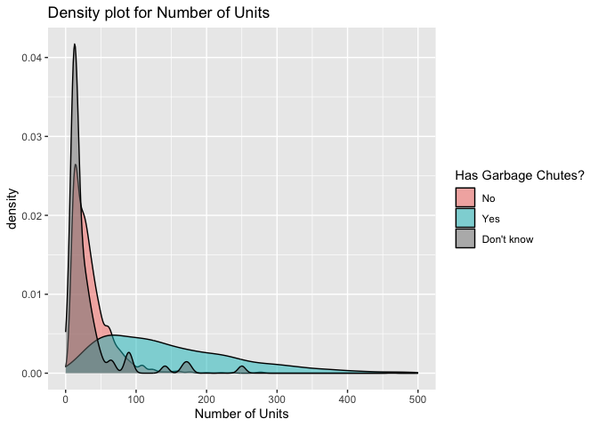
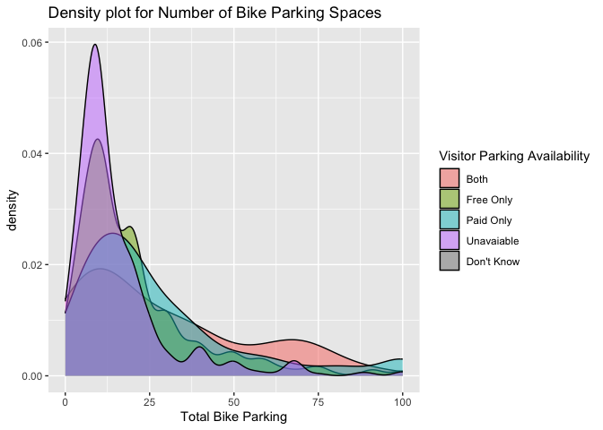
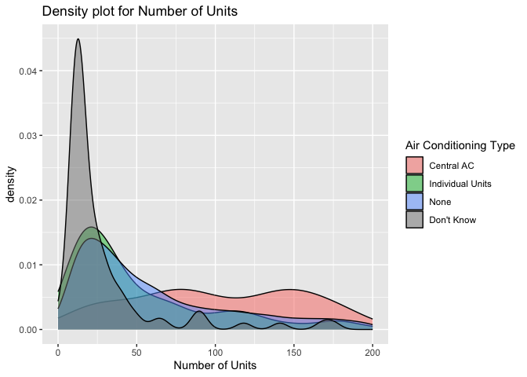
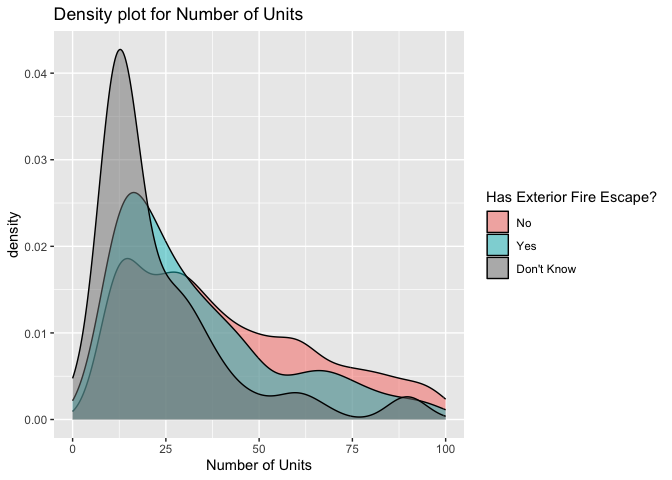

Mini Data Analysis Milestone 2
================

*To complete this milestone, you can edit [this `.rmd`
file](https://github.com/UBC-STAT/STAT545.github.io/blob/main/content/mini-data-analysis/mini-project-2.Rmd)
directly. Fill in the sections that are commented out with
`<!--- start your work here--->`. When you are done, make sure to knit
to an `.md` file by changing the output in the YAML header to
`github_document`, before submitting a tagged release on canvas.*

# Welcome to the rest of your mini data analysis project!

In Milestone 1, you explored your data. and came up with research
questions. This time, we will finish up our mini data analysis and
obtain results for your data by:

- Making summary tables and graphs
- Manipulating special data types in R: factors and/or dates and times.
- Fitting a model object to your data, and extract a result.
- Reading and writing data as separate files.

We will also explore more in depth the concept of *tidy data.*

**NOTE**: The main purpose of the mini data analysis is to integrate
what you learn in class in an analysis. Although each milestone provides
a framework for you to conduct your analysis, it’s possible that you
might find the instructions too rigid for your data set. If this is the
case, you may deviate from the instructions – just make sure you’re
demonstrating a wide range of tools and techniques taught in this class,
and indicate *why* you had to deviate. Feel free to contact the
instructor in these cases.

# Instructions

**To complete this milestone**, edit [this very `.Rmd`
file](https://github.com/UBC-STAT/STAT545.github.io/blob/main/content/mini-data-analysis/mini-project-2.Rmd)
directly. Fill in the sections that are tagged with
`<!--- start your work here--->`.

**To submit this milestone**, make sure to knit this `.Rmd` file to an
`.md` file by changing the YAML output settings from
`output: html_document` to `output: github_document`. Commit and push
all of your work to your mini-analysis GitHub repository, and tag a
release on GitHub. Then, submit a link to your tagged release on canvas.

**Points**: This milestone is worth 50 points: 45 for your analysis, and
5 for overall reproducibility, cleanliness, and coherence of the Github
submission.

**Research Questions**: In Milestone 1, you chose four research
questions to focus on. Wherever realistic, your work in this milestone
should relate to these research questions whenever we ask for
justification behind your work. In the case that some tasks in this
milestone don’t align well with one of your research questions, feel
free to discuss your results in the context of a different research
question.

# Learning Objectives

By the end of this milestone, you should:

- Understand what *tidy* data is, and how to create it using `tidyr`.
- Generate a reproducible and clear report using R Markdown.
- Manipulating special data types in R: factors and/or dates and times.
- Fitting a model object to your data, and extract a result.
- Reading and writing data as separate files.

# Setup

Begin by loading your data and the tidyverse package below:

``` r
library(datateachr) # <- might contain the data you picked!
library(tidyverse)
```

# Task 1: Process and summarize your data

From Milestone 1, you should have an idea of the basic structure of your
dataset (e.g. number of rows and columns, class types, etc.). Here, we
will start investigating your data more in-depth using various data
manipulation functions.

### 1.1 (1 point)

First, write out the 4 research questions you defined in milestone 1
were. This will guide your work through milestone 2:

<!-------------------------- Start your work below ---------------------------->

Of course, here are the questions:

1.  What are the most significant factors that influence whether a
    building would have garbage chutes?
2.  In what ways are the availability of car parking spaces and bicycle
    parking spaces related?
3.  Which variables admit a way of effectively predicting whether or not
    a building has air conditioning?
4.  Do larger and more recent buildings have more robust fire safety
    systems (fire alarm, fire escape, intercom) in place?
    <!----------------------------------------------------------------------------->

Here, we will investigate your data using various data manipulation and
graphing functions.

### 1.2 (8 points)

Now, for each of your four research questions, choose one task from
options 1-4 (summarizing), and one other task from 4-8 (graphing). You
should have 2 tasks done for each research question (8 total). Make sure
it makes sense to do them! (e.g. don’t use a numerical variables for a
task that needs a categorical variable.). Comment on why each task helps
(or doesn’t!) answer the corresponding research question.

Ensure that the output of each operation is printed!

Also make sure that you’re using dplyr and ggplot2 rather than base R.
Outside of this project, you may find that you prefer using base R
functions for certain tasks, and that’s just fine! But part of this
project is for you to practice the tools we learned in class, which is
dplyr and ggplot2.

**Summarizing:**

1.  Compute the *range*, *mean*, and *two other summary statistics* of
    **one numerical variable** across the groups of **one categorical
    variable** from your data.
2.  Compute the number of observations for at least one of your
    categorical variables. Do not use the function `table()`!
3.  Create a categorical variable with 3 or more groups from an existing
    numerical variable. You can use this new variable in the other
    tasks! *An example: age in years into “child, teen, adult, senior”.*
4.  Compute the proportion and counts in each category of one
    categorical variable across the groups of another categorical
    variable from your data. Do not use the function `table()`!

**Graphing:**

6.  Create a graph of your choosing, make one of the axes logarithmic,
    and format the axes labels so that they are “pretty” or easier to
    read.
7.  Make a graph where it makes sense to customize the alpha
    transparency.

Using variables and/or tables you made in one of the “Summarizing”
tasks:

8.  Create a graph that has at least two geom layers.
9.  Create 3 histograms, with each histogram having different sized
    bins. Pick the “best” one and explain why it is the best.

Make sure it’s clear what research question you are doing each operation
for!

<!------------------------- Start your work below ----------------------------->

Before we begin, we are going to first reproduce the work in mda part 1,
where we created a new variable called building_age, which details the
age of the observed apartment building as of 2025.

``` r
apt_buildings_new <- apt_buildings
apt_buildings_new <- mutate(apt_buildings_new, elevator_density = 
                              no_of_elevators / no_of_units, building_age = 
                              2025 - year_built)
```

#### RQ1

What are the most significant factors that influence whether a building
would have garbage chutes?

##### RQ1 Summarizing (TASK 1)

``` r
#Group by garbage_chutes
ans1.2.1 <- apt_buildings_new %>%
  group_by(garbage_chutes) %>%
#Generate summary statistics
  summarise(no_of_units_mean = mean(no_of_units, na.rm=TRUE), 
            no_of_units_3rd_quar = quantile(no_of_units, 0.75, na.rm=TRUE), 
            no_of_units_median = median(no_of_units, na.rm=TRUE), 
            no_of_units_1st_quar = quantile(no_of_units, 0.25, na.rm=TRUE), 
            no_of_units_range = max(no_of_units) - min(no_of_units, na.rm=TRUE))

print(ans1.2.1)
```

    ## # A tibble: 3 × 6
    ##   garbage_chutes no_of_units_mean no_of_units_3rd_quar no_of_units_median
    ##   <chr>                     <dbl>                <dbl>              <dbl>
    ## 1 NO                         35.9                  45                  28
    ## 2 YES                       155.                  210.                128
    ## 3 <NA>                       30.0                  30                  15
    ## # ℹ 2 more variables: no_of_units_1st_quar <dbl>, no_of_units_range <dbl>

Using the code above, we have grouped the observations by the
categorical variable “garbage_chutes”. This categorical variable has
three categories, “No” and “Yes”, including those with values of NA. For
each group, we have computed summary statistics for the numerical
variable “no_of_units”. The computed summary statistics include the
mean, median, range, 1st quartile, and 3rd quartile.

Clearly, by looking at the first four columns of the printed tibble
above, we see that apartments with garbage chutes tend to have more
units than those that don’t. For example, in the “No garbage chute”
group, the mean number of units is 35.868 while in the “Yes garbage
chute” group, the mean number of units is 154.6. We also note that the
latter group has more variable in the number of units, as shown in its
large range of 4101, while observations without garbage chutes have a
range of only 453 in the number of units.

This goes to show that the “no_of_units”, or number of units in an
apartment clearly influence whether or not it will have garbage chutes.

##### RQ1 Graphing (TASK 7)

``` r
answer1.2.2 <- ggplot(apt_buildings_new, aes(x = no_of_units))+
  #Apply alpha to differentiate between overlapping density plots
    geom_density(aes(fill = garbage_chutes), alpha = 0.5)+
    xlim(0,500)+
    xlab("Number of Units") +
    ggtitle("Density plot for Number of Units") +
    scale_fill_discrete(name = "Has Garbage Chutes?", 
                        labels = c("No", "Yes", "Don't know"))
print(answer1.2.2)
```

<!-- -->

Based on the overlapping density plot for “no_of_units” above, grouped
by “garbage_chutes”, we confirm the observations from the previous task.
Again, the plot goes to show that the distribution for “no_of_units”
changes significantly depending on whether or not a building has
“garbage_chutes”. Those that do have a distribution with much higher
mean and variance.

#### RQ2

In what ways are the availability of car parking spaces and bicycle
parking spaces related?

##### RQ2 Summarizing (Task 1)

To complete this task, we first note that the “bike_parking” columne in
the dataset is encoded as a string, despite being a numerical variable.
For example:

    ## [1] "0 indoor parking spots and 10 outdoor parking spots"
    ## [2] "0 indoor parking spots and 34 outdoor parking spots"
    ## [3] "Not Available"                                      
    ## [4] "Not Available"                                      
    ## [5] "12 indoor parking spots and 0 outdoor parking spots"
    ## [6] "Not Available"

Before proceeding, we will first create two new columns therefrom, one
for the number of indoor parking spots, and one for the number of
outdoor parking spots.

``` r
#replace all "Not Available" with NA
apt_buildings_new$bike_parking[apt_buildings_new$bike_parking
                               == "Not Available"] <- NA

apt_buildings_new <- apt_buildings_new %>%
#Create two columns based on indoor and outdoor bike parking spaces
  tidyr::separate(bike_parking, 
                  into = c("indoor_bike_parking", "outdoor_bike_parking"), 
                  sep= "and") %>%
  #Turn these columns into numbers
  mutate(indoor_bike_parking = parse_number(indoor_bike_parking),
         outdoor_bike_parking = parse_number(outdoor_bike_parking)) %>%
  #Re-create the original bike_parking column to show total bike parking
  mutate(bike_parking = indoor_bike_parking + outdoor_bike_parking)
```

``` r
ans1.2.3 <- apt_buildings_new %>%
  ungroup %>%
  group_by(visitor_parking) %>%
#Generate summary statistics
  summarise(bike_parking_mean = mean(bike_parking, na.rm =TRUE), 
            bike_parking_3rd_quar = quantile(bike_parking, 0.75, na.rm =TRUE), 
            bike_parking_median = median(bike_parking, na.rm =TRUE), 
            bike_parking_1st_quar = quantile(bike_parking, 0.25, na.rm =TRUE), 
            bike_parking_range = max(bike_parking, na.rm=TRUE) - min(bike_parking, na.rm=TRUE))

print(ans1.2.3)
```

    ## # A tibble: 5 × 6
    ##   visitor_parking bike_parking_mean bike_parking_3rd_quar bike_parking_median
    ##   <chr>                       <dbl>                 <dbl>               <dbl>
    ## 1 BOTH                         33.9                    40                  20
    ## 2 FREE                         25.4                    30                  15
    ## 3 PAID                         38.9                    40                  20
    ## 4 UNAVAILABLE                  16.9                    20                  10
    ## 5 <NA>                         10                      10                  10
    ## # ℹ 2 more variables: bike_parking_1st_quar <dbl>, bike_parking_range <dbl>

As is the case for RQ1, using the code above, we have grouped the
observations by the categorical variable “visitor_parking”. This
categorical variable has five categories, “Both”, “Free”, “Paid”, and
“Unavailable”, including those with values of NA. For each group, we
have computed summary statistics for the transformed numerical variable
“bike_parking”. The computed summary statistics include the mean,
median, range, 1st quartile, and 3rd quartile. This roster of summary
statistics is similar to what R would ordinarily produce.

Based on the summary, buildings without visitor parking tend to have, on
average, fewer bike parking spaces as well. Moreover, buildings with
free visitor parking only tend to have, on average, less bike parking
than those with paid visitor parking as an option or requirement.
However, looking at the range, we see that bike parking availability
varies a lot within the groups regardless of visitor parking
availability, especially in buildings with only free, or only paid
visitor parking.

This shows that, in general, having visitor parking, and paid visitor
parking in particular, is generally indicative of larger numbers of bike
parking spaces.

##### RQ2 Graphing (Task 7)

``` r
answer1.2.4 <- ggplot(apt_buildings_new, aes(x = bike_parking))+
  #Apply alpha to differentiate between overlapping density plots
    geom_density(aes(fill = visitor_parking), alpha = 0.5)+
    xlim(0,100)+
    xlab("Total Bike Parking") +
    ggtitle("Density plot for Number of Bike Parking Spaces") +
    scale_fill_discrete(name = "Visitor Parking Availability", 
                        labels = c("Both", "Free Only", "Paid Only", "Unavaiable", "Don't Know"))
print(answer1.2.4)
```

<!-- -->

Based on the overlapping density plot above, we again see that, on
average, buildings with free visitor parking only, or without any
visitor parking tend to have fewer bike parking spaces. However, the
general shape of the distribution is similar regardless of the
availability of visitor parking.

#### RQ3

Which variables admit a way of effectively predicting whether or not a
building has air conditioning?

##### RQ3 Summarizing (Task 1)

``` r
ans1.2.5 <- apt_buildings_new %>%
  ungroup %>%
  group_by(air_conditioning) %>%
#Generate summary statistics
  summarise(building_age_mean = mean(building_age, na.rm =TRUE), 
            building_age_3rd_quar = quantile(building_age, 0.75, na.rm =TRUE), 
            building_age_median = median(building_age, na.rm =TRUE), 
            building_age_1st_quar = quantile(building_age, 0.25, na.rm =TRUE), 
            building_age_range = max(building_age, na.rm=TRUE) - min(building_age, na.rm=TRUE))

print(ans1.2.5)
```

    ## # A tibble: 4 × 6
    ##   air_conditioning building_age_mean building_age_3rd_quar building_age_median
    ##   <chr>                        <dbl>                 <dbl>               <dbl>
    ## 1 CENTRAL AIR                   37.4                    52                36  
    ## 2 INDIVIDUAL UNITS              61.7                    72                60  
    ## 3 NONE                          64.8                    70                65  
    ## 4 <NA>                          73.9                    74                70.5
    ## # ℹ 2 more variables: building_age_1st_quar <dbl>, building_age_range <dbl>

Just like before, using the code above, we have grouped the observations
by the categorical variable “air_conditioning”. This categorical
variable has four categories, “Central Air”, “Individual Units”, and
“None”, including some observations that happen to be NA. For each
group, we have computed summary statistics for the transformed numerical
variable “building_age”, which documents the age of the building as of
2025. The computed summary statistics include the mean, median, range,
1st quartile, and 3rd quartile.

Based on the summary, on average, older buildings tend to have no air
conditioning, or have individual units of AC. On the other hand, newer
buildings tend to have central AC. Moreover, we see that in the group
with no air conditioning, the building age tend to have the biggest
variable, as seen in the range.

Again, this indicates building_age as a possible predictor for the type
of air conditioning that an apartment building may have.

##### RQ3 Graphing (Task 7)

``` r
answer1.2.6 <- ggplot(apt_buildings_new, aes(x = no_of_units))+
  #Apply alpha to differentiate between overlapping density plots
    geom_density(aes(fill = air_conditioning), alpha = 0.5)+
    xlim(0,200)+
    xlab("Number of Units") +
    ggtitle("Density plot for Number of Units") +
    scale_fill_discrete(name = "Air Conditioning Type", 
                        labels = c("Central AC", 
                                   "Individual Units", "None", "Don't Know"))
print(answer1.2.6)
```

<!-- -->

Using this overlapping density plot, we see that the distribution for
the number of units is clearly different depending on the type of air
conditioning the building has. In particular, buildings with individual
units or no AC tend to have a smaller number of units, in contrast with
those that has central AC.

This plot indicates that no_of_units is another variable that could
perhaps predict the type of air conditioning a building may have.

#### RQ4

Do larger and more recent buildings have more robust fire safety systems
(fire alarm, fire escape, intercom) in place?

##### RQ4 Summarizing (Task 1)

``` r
ans1.2.7 <- apt_buildings_new %>%
  ungroup %>%
  group_by(fire_alarm) %>%
#Generate summary statistics
  summarise(building_age_mean = mean(building_age, na.rm =TRUE), 
            building_age_3rd_quar = quantile(building_age, 0.75, na.rm =TRUE), 
            building_age_median = median(building_age, na.rm =TRUE), 
            building_age_1st_quar = quantile(building_age, 0.25, na.rm =TRUE), 
            building_age_range = max(building_age, na.rm=TRUE) - min(building_age, na.rm=TRUE))

print(ans1.2.7)
```

    ## # A tibble: 3 × 6
    ##   fire_alarm building_age_mean building_age_3rd_quar building_age_median
    ##   <chr>                  <dbl>                 <dbl>               <dbl>
    ## 1 NO                      70.9                  75.8                68.5
    ## 2 YES                     62.8                  70                  63  
    ## 3 <NA>                    73.6                  74                  70  
    ## # ℹ 2 more variables: building_age_1st_quar <dbl>, building_age_range <dbl>

Using the same technique as before, we have grouped the observations by
the categorical variable “fire_alarm”. This categorical variable has
only three categories, “Yes”, “No”, and some observations which happens
to be NA. For each group, we have computed summary statistics for the
transformed numerical variable “building_age”, just like the case
before, The computed summary statistics include the mean, median, range,
1st quartile, and 3rd quartile.

It seems that there is much greater variance to building age for
buildings with fire alarms, as indicated by the range of 214. Moreover,
there is a slight difference between the average building age across the
groups, with buildings without (or NA) fire alarms being slightly older
than those that do.

This may indicate that more recent buildings generally have better fire
safety measures in place.

##### RQ4 Graphing (Task 7)

``` r
answer1.2.8 <- ggplot(apt_buildings_new, aes(x = no_of_units))+
  #Apply alpha to differentiate between overlapping density plots
    geom_density(aes(fill = exterior_fire_escape), alpha = 0.5)+
    xlim(0,100)+
    xlab("Number of Units") +
    ggtitle("Density plot for Number of Units") +
    scale_fill_discrete(name = "Has Exterior Fire Escape?", 
                        labels = c("No", 
                                   "Yes", "Don't Know"))
print(answer1.2.8)
```

<!-- -->

Based on the overlapping histogram plot above, it appears that the
distribution for the number of units is relatively similar regardless of
whether or not the building has an exterior fire escape. A some minor
difference in the distribution of number of units would be a heavier
right tail for buildings without exterior fire escape.

This shows that building size does not have a significant influence on
the precense of an exterior fire escape.

<!----------------------------------------------------------------------------->

### 1.3 (2 points)

Based on the operations that you’ve completed, how much closer are you
to answering your research questions? Think about what aspects of your
research questions remain unclear. Can your research questions be
refined, now that you’ve investigated your data a bit more? Which
research questions are yielding interesting results?

<!------------------------- Write your answer here ---------------------------->

After completing exercise 1.2, I feel that I have gotten somewhat closer
towards answering my research questions. Specifically, I can now be able
to give a general idea of what the answer ought to be, although I still
may not be able to arrive at a definitive conclusion. Take question 1 as
an example, where I wished to settle “What are the most significant
factors that influence whether a building would have garbage chutes?”.
Based on the result from task 1, it appears that the number of units is
clearly a factor which can influence the existence of garbate chutes.
However, by only looking at summary statistics and histograms, it is
difficult to quantify the significance of the influence versus other
possible variables of interest, such as building age. Similar remarks
could be made about the other 3 research questions as well. For
instance, for RQ3, we have found two possible predictors, but we do not
yet know how these predictors’ statistical significance could be
quantified.

Furthermore, I feel that some of the research questions could perhaps be
further refined: in question 4, as opposed to asking about fire safety
in terms of three variables, we could maybe ask about the number of fire
safety features present, and construct a new variables based off of this
measure. Question 2 could also be refined by being more specific about
what is meant by “availability of car parking spaces”. Since this
dataset does not contain a column that specifically detail the total
size of the building’s parking lot, we should instead explore question 2
by focusing on the type of parking (paid vs. free) as opposed to the
quantity. Moreover, it may also be worthwhile to explore how some other
variables can be related to the availability of bike parking spaces,
such as building age, number of units, etc..

So far, I have found the result of question 2 to be the most
interesting. Based on the graphs produced for that question, it seems
that buildings with free visitor parking has less bike parking spaces,
on average, than those with paid visitor parking. This is unexpected as
I reason that a property that generously furnish its guests with free
car parking ought to also be generous with its provision of bicycle
parking. A justification for the outcome observed in that plot could be
the following: in general, buildings with free visitor parking tend to
be located in less densely population areas, where bicycle transport is
not emphasized.

<!----------------------------------------------------------------------------->

# Task 2: Tidy your data

In this task, we will do several exercises to reshape our data. The goal
here is to understand how to do this reshaping with the `tidyr` package.

A reminder of the definition of *tidy* data:

- Each row is an **observation**
- Each column is a **variable**
- Each cell is a **value**

### 2.1 (2 points)

Based on the definition above, can you identify if your data is tidy or
untidy? Go through all your columns, or if you have \>8 variables, just
pick 8, and explain whether the data is untidy or tidy.

<!--------------------------- Start your work below --------------------------->

> For the purpose of this question, we will be looking at the ORIGINAL
> dataset

    ## Rows: 3,455
    ## Columns: 37
    ## $ id                               <dbl> 10359, 10360, 10361, 10362, 10363, 10…
    ## $ air_conditioning                 <chr> "NONE", "NONE", "NONE", "NONE", "NONE…
    ## $ amenities                        <chr> "Outdoor rec facilities", "Outdoor po…
    ## $ balconies                        <chr> "YES", "YES", "YES", "YES", "NO", "NO…
    ## $ barrier_free_accessibilty_entr   <chr> "YES", "NO", "NO", "YES", "NO", "NO",…
    ## $ bike_parking                     <chr> "0 indoor parking spots and 10 outdoo…
    ## $ exterior_fire_escape             <chr> "NO", "NO", "NO", "YES", "NO", NA, "N…
    ## $ fire_alarm                       <chr> "YES", "YES", "YES", "YES", "YES", "Y…
    ## $ garbage_chutes                   <chr> "YES", "YES", "NO", "NO", "NO", "NO",…
    ## $ heating_type                     <chr> "HOT WATER", "HOT WATER", "HOT WATER"…
    ## $ intercom                         <chr> "YES", "YES", "YES", "YES", "YES", "Y…
    ## $ laundry_room                     <chr> "YES", "YES", "YES", "YES", "YES", "Y…
    ## $ locker_or_storage_room           <chr> "NO", "YES", "YES", "YES", "NO", "YES…
    ## $ no_of_elevators                  <dbl> 3, 3, 0, 1, 0, 0, 0, 2, 4, 2, 0, 2, 2…
    ## $ parking_type                     <chr> "Underground Garage , Garage accessib…
    ## $ pets_allowed                     <chr> "YES", "YES", "YES", "YES", "YES", "Y…
    ## $ prop_management_company_name     <chr> NA, "SCHICKEDANZ BROS. PROPERTIES", N…
    ## $ property_type                    <chr> "PRIVATE", "PRIVATE", "PRIVATE", "PRI…
    ## $ rsn                              <dbl> 4154812, 4154815, 4155295, 4155309, 4…
    ## $ separate_gas_meters              <chr> "NO", "NO", "NO", "NO", "NO", "NO", "…
    ## $ separate_hydro_meters            <chr> "YES", "YES", "YES", "YES", "YES", "Y…
    ## $ separate_water_meters            <chr> "NO", "NO", "NO", "NO", "NO", "NO", "…
    ## $ site_address                     <chr> "65  FOREST MANOR RD", "70  CLIPPER R…
    ## $ sprinkler_system                 <chr> "YES", "YES", "NO", "YES", "NO", "NO"…
    ## $ visitor_parking                  <chr> "PAID", "FREE", "UNAVAILABLE", "UNAVA…
    ## $ ward                             <chr> "17", "17", "03", "03", "02", "02", "…
    ## $ window_type                      <chr> "DOUBLE PANE", "DOUBLE PANE", "DOUBLE…
    ## $ year_built                       <dbl> 1967, 1970, 1927, 1959, 1943, 1952, 1…
    ## $ year_registered                  <dbl> 2017, 2017, 2017, 2017, 2017, NA, 201…
    ## $ no_of_storeys                    <dbl> 17, 14, 4, 5, 4, 4, 4, 7, 32, 4, 4, 7…
    ## $ emergency_power                  <chr> "NO", "YES", "NO", "NO", "NO", "NO", …
    ## $ `non-smoking_building`           <chr> "YES", "NO", "YES", "YES", "YES", "NO…
    ## $ no_of_units                      <dbl> 218, 206, 34, 42, 25, 34, 14, 105, 57…
    ## $ no_of_accessible_parking_spaces  <dbl> 8, 10, 20, 42, 12, 0, 5, 1, 1, 6, 12,…
    ## $ facilities_available             <chr> "Recycling bins", "Green Bin / Organi…
    ## $ cooling_room                     <chr> "NO", "NO", "NO", "NO", "NO", "NO", "…
    ## $ no_barrier_free_accessible_units <dbl> 2, 0, 0, 42, 0, NA, 14, 0, 0, 1, 25, …

As seen in the glimpse above, this dataset is untidy, although the
“Degree of untidiness” is not high. First and foremost, each row is
precisely one obseravtion, an instance of an apartment building. Second,
most columns, with the exception of “amenities” and “bike_parking”,
describe exactly one variable. For those “tidy” columns, each cell is
indeed a value for that variable.

The column for “amenities” is not one variable, but rather provides a
list of amenities the observation has. As such, it contains information
on several different variables, those being whether or not a building
has an “indoor pool”, some “outdoor rec facilities”, a “Child play
area”, etc. To tidy this column, instead of verbally describing the type
of amentities available, one could perhaps have a separate column for
each type of possible amenity, with the values then encoded as “YES”,
“NO”, or NA.

With the way that its entries are encoded, “bike_parking” appears to be
a column that details two variables. Its values include both the number
of indoor bike parking spaces and outdoor bike parking spaces while
excluding the sum of those numbers. To tidy this dataset, one should
seperate “bike_parking” into two columns, with their values including
only the number of the relevant type of parking spaces (indoor
vs. outdoor).

<!----------------------------------------------------------------------------->

### 2.2 (4 points)

Now, if your data is tidy, untidy it! Then, tidy it back to it’s
original state.

If your data is untidy, then tidy it! Then, untidy it back to it’s
original state.

Be sure to explain your reasoning for this task. Show us the “before”
and “after”.

<!--------------------------- Start your work below --------------------------->

As stated above, there are two reasons why this data is untidy: the
columns “bike_parking” and “amentities” contain more than one variable
each. Thus, to tidy this dataset, we will be widening it by adding the
variables implied by these two columns as seperate columns in their own
right.

To fix “bike_parking”, we first note that, originally, this column
contain two variables, the number of indoor bike parking spaces and the
number of outdoor bike parking spaces. As such, we will need to seperate
the original into two columns, one for indoor and one for door door. The
cells for these columns ought to contain only numerical values, without
the string identifier “indoor parking spots”.

This code chunk should do just that:

``` r
#this is the same step as seen in exercise 1.2
#replace all "Not Available" with NA
apt_buildings_tidy = apt_buildings
apt_buildings_tidy$bike_parking[apt_buildings_tidy$bike_parking
                               == "Not Available"] <- NA

apt_buildings_tidy <- apt_buildings_tidy %>%
#Create two columns based on indoor and outdoor bike parking spaces
  tidyr::separate(bike_parking, 
                  into = c("indoor_bike_parking", "outdoor_bike_parking"), 
                  sep= "and") %>%
  #Turn these columns into numbers
  mutate(indoor_bike_parking = parse_number(indoor_bike_parking),
         outdoor_bike_parking = parse_number(outdoor_bike_parking))
```

Next, to fix “amenities”, we will first point out that the column
contain 7 variables (identified with the code chunk below), and the
cells contain a string that states which ones out of the seven amenities
are available within an apartment building. Therefore, to tidy this
column, we will create a new column for each one of the seven type of
amenities. For these new columns, the cell should simply state whether
or not a given observation has the amenity in question, taking on a
value of “YES” or “NO”.

``` r
#Find the types of amentities that could be in place
unique(unlist(strsplit(as.character(apt_buildings_tidy$amenities), " , ")))
```

    ## [1] "Outdoor rec facilities" "Outdoor pool"           NA                      
    ## [4] "Indoor pool"            "Indoor recreation room" "Indoor exercise room"  
    ## [7] "Sauna"                  "Child play area"

``` r
#Creating the appropriate columns for the 7 types of amenities

apt_buildings_tidy <- apt_buildings_tidy %>%
#outdoor rec facilities  
  mutate(outdoor_rec_facilities = ifelse(
    grepl("Outdoor rec facilities",amenities)== TRUE, "YES", "NO")) %>%
#indoor pool  
  mutate(indoor_pool = ifelse(
    grepl("Indoor pool",amenities)== TRUE, "YES", "NO")) %>%
#outdoor pool  
  mutate(outdoor_pool = ifelse(
    grepl("Outdoor pool",amenities)== TRUE, "YES", "NO")) %>%
#indoor recreation room    
  mutate(indoor_recreation_room = ifelse(
    grepl("Indoor recreation room",amenities)== TRUE, "YES", "NO")) %>%
#indoor exercise room  
  mutate(indoor_exercise_room = ifelse(
    grepl("Indoor exercise room",amenities)== TRUE, "YES", "NO")) %>%
#sauna  
  mutate(sauna = ifelse(
    grepl("Sauna",amenities)== TRUE, "YES", "NO")) %>%
#child play area  
  mutate(child_play_area = ifelse(
    grepl("Child play area",amenities)== TRUE, "YES", "NO"))

#Remove original columns

apt_buildings_tidy <- select(apt_buildings_tidy, -amenities)
```

###### Pre-tidying Dataset

``` r
glimpse(apt_buildings)
```

    ## Rows: 3,455
    ## Columns: 37
    ## $ id                               <dbl> 10359, 10360, 10361, 10362, 10363, 10…
    ## $ air_conditioning                 <chr> "NONE", "NONE", "NONE", "NONE", "NONE…
    ## $ amenities                        <chr> "Outdoor rec facilities", "Outdoor po…
    ## $ balconies                        <chr> "YES", "YES", "YES", "YES", "NO", "NO…
    ## $ barrier_free_accessibilty_entr   <chr> "YES", "NO", "NO", "YES", "NO", "NO",…
    ## $ bike_parking                     <chr> "0 indoor parking spots and 10 outdoo…
    ## $ exterior_fire_escape             <chr> "NO", "NO", "NO", "YES", "NO", NA, "N…
    ## $ fire_alarm                       <chr> "YES", "YES", "YES", "YES", "YES", "Y…
    ## $ garbage_chutes                   <chr> "YES", "YES", "NO", "NO", "NO", "NO",…
    ## $ heating_type                     <chr> "HOT WATER", "HOT WATER", "HOT WATER"…
    ## $ intercom                         <chr> "YES", "YES", "YES", "YES", "YES", "Y…
    ## $ laundry_room                     <chr> "YES", "YES", "YES", "YES", "YES", "Y…
    ## $ locker_or_storage_room           <chr> "NO", "YES", "YES", "YES", "NO", "YES…
    ## $ no_of_elevators                  <dbl> 3, 3, 0, 1, 0, 0, 0, 2, 4, 2, 0, 2, 2…
    ## $ parking_type                     <chr> "Underground Garage , Garage accessib…
    ## $ pets_allowed                     <chr> "YES", "YES", "YES", "YES", "YES", "Y…
    ## $ prop_management_company_name     <chr> NA, "SCHICKEDANZ BROS. PROPERTIES", N…
    ## $ property_type                    <chr> "PRIVATE", "PRIVATE", "PRIVATE", "PRI…
    ## $ rsn                              <dbl> 4154812, 4154815, 4155295, 4155309, 4…
    ## $ separate_gas_meters              <chr> "NO", "NO", "NO", "NO", "NO", "NO", "…
    ## $ separate_hydro_meters            <chr> "YES", "YES", "YES", "YES", "YES", "Y…
    ## $ separate_water_meters            <chr> "NO", "NO", "NO", "NO", "NO", "NO", "…
    ## $ site_address                     <chr> "65  FOREST MANOR RD", "70  CLIPPER R…
    ## $ sprinkler_system                 <chr> "YES", "YES", "NO", "YES", "NO", "NO"…
    ## $ visitor_parking                  <chr> "PAID", "FREE", "UNAVAILABLE", "UNAVA…
    ## $ ward                             <chr> "17", "17", "03", "03", "02", "02", "…
    ## $ window_type                      <chr> "DOUBLE PANE", "DOUBLE PANE", "DOUBLE…
    ## $ year_built                       <dbl> 1967, 1970, 1927, 1959, 1943, 1952, 1…
    ## $ year_registered                  <dbl> 2017, 2017, 2017, 2017, 2017, NA, 201…
    ## $ no_of_storeys                    <dbl> 17, 14, 4, 5, 4, 4, 4, 7, 32, 4, 4, 7…
    ## $ emergency_power                  <chr> "NO", "YES", "NO", "NO", "NO", "NO", …
    ## $ `non-smoking_building`           <chr> "YES", "NO", "YES", "YES", "YES", "NO…
    ## $ no_of_units                      <dbl> 218, 206, 34, 42, 25, 34, 14, 105, 57…
    ## $ no_of_accessible_parking_spaces  <dbl> 8, 10, 20, 42, 12, 0, 5, 1, 1, 6, 12,…
    ## $ facilities_available             <chr> "Recycling bins", "Green Bin / Organi…
    ## $ cooling_room                     <chr> "NO", "NO", "NO", "NO", "NO", "NO", "…
    ## $ no_barrier_free_accessible_units <dbl> 2, 0, 0, 42, 0, NA, 14, 0, 0, 1, 25, …

###### Post-tidying Dataset

``` r
glimpse(apt_buildings_tidy)
```

    ## Rows: 3,455
    ## Columns: 44
    ## $ id                               <dbl> 10359, 10360, 10361, 10362, 10363, 10…
    ## $ air_conditioning                 <chr> "NONE", "NONE", "NONE", "NONE", "NONE…
    ## $ balconies                        <chr> "YES", "YES", "YES", "YES", "NO", "NO…
    ## $ barrier_free_accessibilty_entr   <chr> "YES", "NO", "NO", "YES", "NO", "NO",…
    ## $ indoor_bike_parking              <dbl> 0, 0, NA, NA, 12, NA, NA, NA, 0, NA, …
    ## $ outdoor_bike_parking             <dbl> 10, 34, NA, NA, 0, NA, NA, NA, 15, NA…
    ## $ exterior_fire_escape             <chr> "NO", "NO", "NO", "YES", "NO", NA, "N…
    ## $ fire_alarm                       <chr> "YES", "YES", "YES", "YES", "YES", "Y…
    ## $ garbage_chutes                   <chr> "YES", "YES", "NO", "NO", "NO", "NO",…
    ## $ heating_type                     <chr> "HOT WATER", "HOT WATER", "HOT WATER"…
    ## $ intercom                         <chr> "YES", "YES", "YES", "YES", "YES", "Y…
    ## $ laundry_room                     <chr> "YES", "YES", "YES", "YES", "YES", "Y…
    ## $ locker_or_storage_room           <chr> "NO", "YES", "YES", "YES", "NO", "YES…
    ## $ no_of_elevators                  <dbl> 3, 3, 0, 1, 0, 0, 0, 2, 4, 2, 0, 2, 2…
    ## $ parking_type                     <chr> "Underground Garage , Garage accessib…
    ## $ pets_allowed                     <chr> "YES", "YES", "YES", "YES", "YES", "Y…
    ## $ prop_management_company_name     <chr> NA, "SCHICKEDANZ BROS. PROPERTIES", N…
    ## $ property_type                    <chr> "PRIVATE", "PRIVATE", "PRIVATE", "PRI…
    ## $ rsn                              <dbl> 4154812, 4154815, 4155295, 4155309, 4…
    ## $ separate_gas_meters              <chr> "NO", "NO", "NO", "NO", "NO", "NO", "…
    ## $ separate_hydro_meters            <chr> "YES", "YES", "YES", "YES", "YES", "Y…
    ## $ separate_water_meters            <chr> "NO", "NO", "NO", "NO", "NO", "NO", "…
    ## $ site_address                     <chr> "65  FOREST MANOR RD", "70  CLIPPER R…
    ## $ sprinkler_system                 <chr> "YES", "YES", "NO", "YES", "NO", "NO"…
    ## $ visitor_parking                  <chr> "PAID", "FREE", "UNAVAILABLE", "UNAVA…
    ## $ ward                             <chr> "17", "17", "03", "03", "02", "02", "…
    ## $ window_type                      <chr> "DOUBLE PANE", "DOUBLE PANE", "DOUBLE…
    ## $ year_built                       <dbl> 1967, 1970, 1927, 1959, 1943, 1952, 1…
    ## $ year_registered                  <dbl> 2017, 2017, 2017, 2017, 2017, NA, 201…
    ## $ no_of_storeys                    <dbl> 17, 14, 4, 5, 4, 4, 4, 7, 32, 4, 4, 7…
    ## $ emergency_power                  <chr> "NO", "YES", "NO", "NO", "NO", "NO", …
    ## $ `non-smoking_building`           <chr> "YES", "NO", "YES", "YES", "YES", "NO…
    ## $ no_of_units                      <dbl> 218, 206, 34, 42, 25, 34, 14, 105, 57…
    ## $ no_of_accessible_parking_spaces  <dbl> 8, 10, 20, 42, 12, 0, 5, 1, 1, 6, 12,…
    ## $ facilities_available             <chr> "Recycling bins", "Green Bin / Organi…
    ## $ cooling_room                     <chr> "NO", "NO", "NO", "NO", "NO", "NO", "…
    ## $ no_barrier_free_accessible_units <dbl> 2, 0, 0, 42, 0, NA, 14, 0, 0, 1, 25, …
    ## $ outdoor_rec_facilities           <chr> "YES", "NO", "NO", "NO", "NO", "NO", …
    ## $ indoor_pool                      <chr> "NO", "NO", "NO", "NO", "NO", "NO", "…
    ## $ outdoor_pool                     <chr> "NO", "YES", "NO", "NO", "NO", "NO", …
    ## $ indoor_recreation_room           <chr> "NO", "NO", "NO", "NO", "NO", "NO", "…
    ## $ indoor_exercise_room             <chr> "NO", "NO", "NO", "NO", "NO", "NO", "…
    ## $ sauna                            <chr> "NO", "NO", "NO", "NO", "NO", "NO", "…
    ## $ child_play_area                  <chr> "NO", "NO", "NO", "NO", "NO", "NO", "…

We will now attempt to untidy the data back into its original state

``` r
#uniting the two bike_parking columns
re_apt_buildings_tidy <- apt_buildings_tidy %>%
  tidyr::unite(col = "bike_parking", c("indoor_bike_parking", "outdoor_bike_parking"), sep = " indoor parking spots , ") %>%
  mutate(bike_parking = paste0(bike_parking, " outdoor parking spots"))

#Make all NA value be displayed as "Not Available
re_apt_buildings_tidy$bike_parking[re_apt_buildings_tidy$bike_parking
                               == "NA indoor parking spots , NA outdoor parking spots"] <- "Not Available"
```

``` r
#recreating the amenities column

re_apt_buildings_tidy <- re_apt_buildings_tidy %>%
  
#  [1] "Outdoor rec facilities" "Outdoor pool"           NA                       "Indoor pool"           
# [5] "Indoor recreation room" "Indoor exercise room"   "Sauna"                  "Child play area"     

#outdoor rec facilities  
  mutate(outdoor_rec_facilities = ifelse(
    grepl("YES", outdoor_rec_facilities)== TRUE, "Outdoor rec facilities", NA)) %>%
  mutate(outdoor_pool = ifelse(
    grepl("YES", outdoor_pool)== TRUE, "Outdoor pool", NA)) %>%
  mutate(indoor_pool = ifelse(
    grepl("YES", indoor_pool)== TRUE, "Indoor pool", NA)) %>%
  mutate(indoor_recreation_room = ifelse(
    grepl("YES", outdoor_pool)== TRUE, "Indoor recreation room", NA)) %>%
  mutate(indoor_exercise_room = ifelse(
    grepl("YES", outdoor_pool)== TRUE, "Indoor exercise room", NA)) %>%
  mutate(sauna = ifelse(
    grepl("YES", outdoor_pool)== TRUE, "Sauna", NA)) %>%
  mutate(child_play_area = ifelse(
    grepl("YES", outdoor_pool)== TRUE, "Child play area", NA))
  

re_apt_buildings_tidy <- re_apt_buildings_tidy %>%
    tidyr::unite(col = "amenities", c("outdoor_rec_facilities", "outdoor_pool", "indoor_pool", "indoor_recreation_room", "indoor_exercise_room", "sauna", "child_play_area"), sep = " , ", na.rm = TRUE)

#Replace empty strings with NA

re_apt_buildings_tidy$amenities[re_apt_buildings_tidy$amenities == ""] <- NA
```

Here, we get the un-tidied data back:

``` r
glimpse(re_apt_buildings_tidy)
```

    ## Rows: 3,455
    ## Columns: 37
    ## $ id                               <dbl> 10359, 10360, 10361, 10362, 10363, 10…
    ## $ air_conditioning                 <chr> "NONE", "NONE", "NONE", "NONE", "NONE…
    ## $ balconies                        <chr> "YES", "YES", "YES", "YES", "NO", "NO…
    ## $ barrier_free_accessibilty_entr   <chr> "YES", "NO", "NO", "YES", "NO", "NO",…
    ## $ bike_parking                     <chr> "0 indoor parking spots , 10 outdoor …
    ## $ exterior_fire_escape             <chr> "NO", "NO", "NO", "YES", "NO", NA, "N…
    ## $ fire_alarm                       <chr> "YES", "YES", "YES", "YES", "YES", "Y…
    ## $ garbage_chutes                   <chr> "YES", "YES", "NO", "NO", "NO", "NO",…
    ## $ heating_type                     <chr> "HOT WATER", "HOT WATER", "HOT WATER"…
    ## $ intercom                         <chr> "YES", "YES", "YES", "YES", "YES", "Y…
    ## $ laundry_room                     <chr> "YES", "YES", "YES", "YES", "YES", "Y…
    ## $ locker_or_storage_room           <chr> "NO", "YES", "YES", "YES", "NO", "YES…
    ## $ no_of_elevators                  <dbl> 3, 3, 0, 1, 0, 0, 0, 2, 4, 2, 0, 2, 2…
    ## $ parking_type                     <chr> "Underground Garage , Garage accessib…
    ## $ pets_allowed                     <chr> "YES", "YES", "YES", "YES", "YES", "Y…
    ## $ prop_management_company_name     <chr> NA, "SCHICKEDANZ BROS. PROPERTIES", N…
    ## $ property_type                    <chr> "PRIVATE", "PRIVATE", "PRIVATE", "PRI…
    ## $ rsn                              <dbl> 4154812, 4154815, 4155295, 4155309, 4…
    ## $ separate_gas_meters              <chr> "NO", "NO", "NO", "NO", "NO", "NO", "…
    ## $ separate_hydro_meters            <chr> "YES", "YES", "YES", "YES", "YES", "Y…
    ## $ separate_water_meters            <chr> "NO", "NO", "NO", "NO", "NO", "NO", "…
    ## $ site_address                     <chr> "65  FOREST MANOR RD", "70  CLIPPER R…
    ## $ sprinkler_system                 <chr> "YES", "YES", "NO", "YES", "NO", "NO"…
    ## $ visitor_parking                  <chr> "PAID", "FREE", "UNAVAILABLE", "UNAVA…
    ## $ ward                             <chr> "17", "17", "03", "03", "02", "02", "…
    ## $ window_type                      <chr> "DOUBLE PANE", "DOUBLE PANE", "DOUBLE…
    ## $ year_built                       <dbl> 1967, 1970, 1927, 1959, 1943, 1952, 1…
    ## $ year_registered                  <dbl> 2017, 2017, 2017, 2017, 2017, NA, 201…
    ## $ no_of_storeys                    <dbl> 17, 14, 4, 5, 4, 4, 4, 7, 32, 4, 4, 7…
    ## $ emergency_power                  <chr> "NO", "YES", "NO", "NO", "NO", "NO", …
    ## $ `non-smoking_building`           <chr> "YES", "NO", "YES", "YES", "YES", "NO…
    ## $ no_of_units                      <dbl> 218, 206, 34, 42, 25, 34, 14, 105, 57…
    ## $ no_of_accessible_parking_spaces  <dbl> 8, 10, 20, 42, 12, 0, 5, 1, 1, 6, 12,…
    ## $ facilities_available             <chr> "Recycling bins", "Green Bin / Organi…
    ## $ cooling_room                     <chr> "NO", "NO", "NO", "NO", "NO", "NO", "…
    ## $ no_barrier_free_accessible_units <dbl> 2, 0, 0, 42, 0, NA, 14, 0, 0, 1, 25, …
    ## $ amenities                        <chr> "Outdoor rec facilities", "Outdoor po…

<!----------------------------------------------------------------------------->

### 2.3 (4 points)

Now, you should be more familiar with your data, and also have made
progress in answering your research questions. Based on your interest,
and your analyses, pick 2 of the 4 research questions to continue your
analysis in the remaining tasks:

<!-------------------------- Start your work below ---------------------------->

1.  Which variables admit a way of effectively predicting whether or not
    a building has air conditioning? (QR3)
2.  In what ways are the availability of car parking spaces and bicycle
    parking spaces related? (QR2)

<!----------------------------------------------------------------------------->

Explain your decision for choosing the above two research questions.

<!--------------------------- Start your work below --------------------------->

I have decided to select question 3 because the results from part 1.2
have already presented “no_of_units” and “building_age” as two important
predictors of interest. This puts us into a good position to answer this
question. By potentially fitting a model using these two variable among
several others, as independent variables, we could effectively identify
the one whose regression coefficient has the smallest p value, therefore
highlighting that one as the most effective at prediction. Furthermore,
as I personally evaluate the suitability of a rental property, I always
assign substantial importance to whether or not the unit has an AC.
Thus, the potential answer to this research question could help me more
effectively identify, by inspection, whether a buildings’ unit has AC or
not.

Question 2 was selected primarily because of previous findings from part
1.2. In answer 1.3, I have already remarked on how the summary
statistics of bike_parking as grouped by visitor_parking delivered a
counter-intuitive results. Although there are some possible explanations
for this discrepancy, as stated above, it would be worthwhile for me to
further explore the relationships present here within the data.

<!----------------------------------------------------------------------------->

Now, try to choose a version of your data that you think will be
appropriate to answer these 2 questions. Use between 4 and 8 functions
that we’ve covered so far (i.e. by filtering, cleaning, tidy’ing,
dropping irrelevant columns, etc.).

(If it makes more sense, then you can make/pick two versions of your
data, one for each research question.)

<!--------------------------- Start your work below --------------------------->

#### Dataset for Question 1

For this question, we will be starting with the tidied data-set (see
above for that process), since the original data-set’s “amenities” and
“bike_parking” columns are not encoded property as categorical and
numerical variables, respectively. This will make it difficult for us to
do predictive modelling.

Next, we will be performing the following steps: 1. Remove
identification variables (“rsn”, “ward”, “id”, “site_address”,
“prop_management_company_name”) 2. Filter out selections where
“air_conditioning” has a value of NA, 3. Replace “year_built” with
building_age”, which is easier to interpret 4. Combine the
“air_conditioning” categories “central air” and “individual_unit”, since
we are only interested in whether there is AC, not the type of AC

The following code would create the dataset:

``` r
data_Q1 <- apt_buildings_tidy %>%
  select(-rsn, -ward, -id, -site_address, -prop_management_company_name) %>%
  filter(air_conditioning != "NA") %>%
  mutate(year_built = 2025 - year_built) %>%
  rename(building_age = year_built) %>%
  mutate(air_conditioning = ifelse(
    air_conditioning == "NONE", "NO", "YES"))

glimpse(data_Q1)
```

    ## Rows: 3,370
    ## Columns: 39
    ## $ air_conditioning                 <chr> "NO", "NO", "NO", "NO", "NO", "NO", "…
    ## $ balconies                        <chr> "YES", "YES", "YES", "YES", "NO", "NO…
    ## $ barrier_free_accessibilty_entr   <chr> "YES", "NO", "NO", "YES", "NO", "NO",…
    ## $ indoor_bike_parking              <dbl> 0, 0, NA, NA, 12, NA, NA, NA, 0, NA, …
    ## $ outdoor_bike_parking             <dbl> 10, 34, NA, NA, 0, NA, NA, NA, 15, NA…
    ## $ exterior_fire_escape             <chr> "NO", "NO", "NO", "YES", "NO", NA, "N…
    ## $ fire_alarm                       <chr> "YES", "YES", "YES", "YES", "YES", "Y…
    ## $ garbage_chutes                   <chr> "YES", "YES", "NO", "NO", "NO", "NO",…
    ## $ heating_type                     <chr> "HOT WATER", "HOT WATER", "HOT WATER"…
    ## $ intercom                         <chr> "YES", "YES", "YES", "YES", "YES", "Y…
    ## $ laundry_room                     <chr> "YES", "YES", "YES", "YES", "YES", "Y…
    ## $ locker_or_storage_room           <chr> "NO", "YES", "YES", "YES", "NO", "YES…
    ## $ no_of_elevators                  <dbl> 3, 3, 0, 1, 0, 0, 0, 2, 4, 2, 0, 2, 2…
    ## $ parking_type                     <chr> "Underground Garage , Garage accessib…
    ## $ pets_allowed                     <chr> "YES", "YES", "YES", "YES", "YES", "Y…
    ## $ property_type                    <chr> "PRIVATE", "PRIVATE", "PRIVATE", "PRI…
    ## $ separate_gas_meters              <chr> "NO", "NO", "NO", "NO", "NO", "NO", "…
    ## $ separate_hydro_meters            <chr> "YES", "YES", "YES", "YES", "YES", "Y…
    ## $ separate_water_meters            <chr> "NO", "NO", "NO", "NO", "NO", "NO", "…
    ## $ sprinkler_system                 <chr> "YES", "YES", "NO", "YES", "NO", "NO"…
    ## $ visitor_parking                  <chr> "PAID", "FREE", "UNAVAILABLE", "UNAVA…
    ## $ window_type                      <chr> "DOUBLE PANE", "DOUBLE PANE", "DOUBLE…
    ## $ building_age                     <dbl> 58, 55, 98, 66, 82, 73, 66, 54, 56, 5…
    ## $ year_registered                  <dbl> 2017, 2017, 2017, 2017, 2017, NA, 201…
    ## $ no_of_storeys                    <dbl> 17, 14, 4, 5, 4, 4, 4, 7, 32, 4, 4, 7…
    ## $ emergency_power                  <chr> "NO", "YES", "NO", "NO", "NO", "NO", …
    ## $ `non-smoking_building`           <chr> "YES", "NO", "YES", "YES", "YES", "NO…
    ## $ no_of_units                      <dbl> 218, 206, 34, 42, 25, 34, 14, 105, 57…
    ## $ no_of_accessible_parking_spaces  <dbl> 8, 10, 20, 42, 12, 0, 5, 1, 1, 6, 12,…
    ## $ facilities_available             <chr> "Recycling bins", "Green Bin / Organi…
    ## $ cooling_room                     <chr> "NO", "NO", "NO", "NO", "NO", "NO", "…
    ## $ no_barrier_free_accessible_units <dbl> 2, 0, 0, 42, 0, NA, 14, 0, 0, 1, 25, …
    ## $ outdoor_rec_facilities           <chr> "YES", "NO", "NO", "NO", "NO", "NO", …
    ## $ indoor_pool                      <chr> "NO", "NO", "NO", "NO", "NO", "NO", "…
    ## $ outdoor_pool                     <chr> "NO", "YES", "NO", "NO", "NO", "NO", …
    ## $ indoor_recreation_room           <chr> "NO", "NO", "NO", "NO", "NO", "NO", "…
    ## $ indoor_exercise_room             <chr> "NO", "NO", "NO", "NO", "NO", "NO", "…
    ## $ sauna                            <chr> "NO", "NO", "NO", "NO", "NO", "NO", "…
    ## $ child_play_area                  <chr> "NO", "NO", "NO", "NO", "NO", "NO", "…

#### Dataset for Question 2

For this question, we will also be starting with the tidied data-set,
since the original dataset’s formatting for “bike_parking” does not
allow for easy analysis of this variable.

Next, we will be performing the following steps: 1. Creating a new
variable for total bike parking 2. Create a new variable for
total_car_parking by multiplying “no_of_accessible_parking_spaces” by
25\* 3. Remove all columns that are un-related to bike or car parking
(i.e., we are keeping “indoor_bike_parking”, “outdoor_bike_parking”,
“visitor_parking”, “no_of_accessible_parking_spaces”, “parking_type”,
and the columns created in our previous steps) 4. Filter out all
incomplete cases

\*Based on regulations from Ontario (where the dataset was created), 1
in 25 parking spots are required by law to be accessible

Abraham, Tony. “Accessible Parking Requirements in Canada: A Complete
Guide.” A Complete Guide to Accessible Parking Requirements in Canada,
Accessibility Partners Canada, 20 Jan. 2025,
accessibilitypartners.ca/accessible-parking-requirements-canada/

The following code would produce this dataset:

``` r
data_Q2 <- apt_buildings_tidy %>%
  mutate(total_bike_parking = indoor_bike_parking + outdoor_bike_parking) %>%
  mutate(total_car_parking = no_of_accessible_parking_spaces * 25) %>%
  select(total_car_parking, total_bike_parking, indoor_bike_parking, outdoor_bike_parking, visitor_parking, no_of_accessible_parking_spaces, parking_type) %>%
  drop_na
  

glimpse(data_Q2)
```

    ## Rows: 1,011
    ## Columns: 7
    ## $ total_car_parking               <dbl> 200, 250, 300, 25, 0, 0, 425, 125, 75,…
    ## $ total_bike_parking              <dbl> 10, 34, 12, 15, 7, 102, 18, 75, 71, 36…
    ## $ indoor_bike_parking             <dbl> 0, 0, 12, 0, 0, 12, 0, 75, 71, 36, 16,…
    ## $ outdoor_bike_parking            <dbl> 10, 34, 0, 15, 7, 90, 18, 0, 0, 0, 16,…
    ## $ visitor_parking                 <chr> "PAID", "FREE", "UNAVAILABLE", "PAID",…
    ## $ no_of_accessible_parking_spaces <dbl> 8, 10, 12, 1, 0, 0, 17, 5, 3, 2, 0, 22…
    ## $ parking_type                    <chr> "Underground Garage , Garage accessibl…

<!----------------------------------------------------------------------------->

# Task 3: Modelling

## 3.0 (no points)

Pick a research question from 1.2, and pick a variable of interest
(we’ll call it “Y”) that’s relevant to the research question. Indicate
these.

<!-------------------------- Start your work below ---------------------------->

**Research Question**: Which variables admit a way of effectively
predicting whether or not a building has air conditioning?

**Variable of interest**: “air_conditioning”

<!----------------------------------------------------------------------------->

## 3.1 (3 points)

Fit a model or run a hypothesis test that provides insight on this
variable with respect to the research question. Store the model object
as a variable, and print its output to screen. We’ll omit having to
justify your choice, because we don’t expect you to know about model
specifics in STAT 545.

- **Note**: It’s OK if you don’t know how these models/tests work. Here
  are some examples of things you can do here, but the sky’s the limit.

  - You could fit a model that makes predictions on Y using another
    variable, by using the `lm()` function.
  - You could test whether the mean of Y equals 0 using `t.test()`, or
    maybe the mean across two groups are different using `t.test()`, or
    maybe the mean across multiple groups are different using `anova()`
    (you may have to pivot your data for the latter two).
  - You could use `lm()` to test for significance of regression
    coefficients.

<!-------------------------- Start your work below ---------------------------->

For the purpose of this question, we will be using the dataset
identified for part 2.3. Based on this dataset, we will be fitting a
logistic regression model with “air_conditioning” as the predictor.
Moreover, we will be using “building_age” and “no_of_units” as the two
predictors of this model.

``` r
ans3.1 <- glm(as.factor(air_conditioning) ~ building_age + no_of_units, 
              family=binomial(link='logit'), data = data_Q1)

print(ans3.1)
```

    ## 
    ## Call:  glm(formula = as.factor(air_conditioning) ~ building_age + no_of_units, 
    ##     family = binomial(link = "logit"), data = data_Q1)
    ## 
    ## Coefficients:
    ##  (Intercept)  building_age   no_of_units  
    ##     0.453584     -0.040320      0.001339  
    ## 
    ## Degrees of Freedom: 3367 Total (i.e. Null);  3365 Residual
    ##   (2 observations deleted due to missingness)
    ## Null Deviance:       2822 
    ## Residual Deviance: 2584  AIC: 2590

<!----------------------------------------------------------------------------->

## 3.2 (3 points)

Produce something relevant from your fitted model: either predictions on
Y, or a single value like a regression coefficient or a p-value.

- Be sure to indicate in writing what you chose to produce.
- Your code should either output a tibble (in which case you should
  indicate the column that contains the thing you’re looking for), or
  the thing you’re looking for itself.
- Obtain your results using the `broom` package if possible. If your
  model is not compatible with the broom function you’re needing, then
  you can obtain your results by some other means, but first indicate
  which broom function is not compatible.

<!-------------------------- Start your work below ---------------------------->

We will be producing using broom the p value of the z-test which tests
the null hypothesis that the regression coefficient for “no_of_units”
equals 0.

``` r
ans3.2 <- broom::tidy(ans3.1)[3,5]
paste0("The p value in question is ", ans3.2, ".")
```

    ## [1] "The p value in question is 0.00543271241417402."

<!----------------------------------------------------------------------------->

# Task 4: Reading and writing data

Get set up for this exercise by making a folder called `output` in the
top level of your project folder / repository. You’ll be saving things
there.

## 4.1 (3 points)

Take a summary table that you made from Task 1, and write it as a csv
file in your `output` folder. Use the `here::here()` function.

- **Robustness criteria**: You should be able to move your Mini Project
  repository / project folder to some other location on your computer,
  or move this very Rmd file to another location within your project
  repository / folder, and your code should still work.
- **Reproducibility criteria**: You should be able to delete the csv
  file, and remake it simply by knitting this Rmd file.

<!-------------------------- Start your work below ---------------------------->

``` r
#install.packages("here")
library(here)
```

    ## here() starts at /Users/mutianliu/Desktop/Education/UBC/Toolbox Theory 4 (STA545)/R-Projects/Mini Data Analysis

``` r
write_csv(ans1.2.1, here::here("output", "summary_table.csv"))
```

<!----------------------------------------------------------------------------->

## 4.2 (3 points)

Write your model object from Task 3 to an R binary file (an RDS), and
load it again. Be sure to save the binary file in your `output` folder.
Use the functions `saveRDS()` and `readRDS()`.

- The same robustness and reproducibility criteria as in 4.1 apply here.

<!-------------------------- Start your work below ---------------------------->

``` r
#creating the R binary file
saveRDS(ans3.1, here::here("output", "my_model.rsd"))

#loading the R binary file
ans4.2 <- readRDS(here::here("output", "my_model.rsd"))
print(ans4.2)
```

    ## 
    ## Call:  glm(formula = as.factor(air_conditioning) ~ building_age + no_of_units, 
    ##     family = binomial(link = "logit"), data = data_Q1)
    ## 
    ## Coefficients:
    ##  (Intercept)  building_age   no_of_units  
    ##     0.453584     -0.040320      0.001339  
    ## 
    ## Degrees of Freedom: 3367 Total (i.e. Null);  3365 Residual
    ##   (2 observations deleted due to missingness)
    ## Null Deviance:       2822 
    ## Residual Deviance: 2584  AIC: 2590

<!----------------------------------------------------------------------------->

# Overall Reproducibility/Cleanliness/Coherence Checklist

Here are the criteria we’re looking for.

## Coherence (0.5 points)

The document should read sensibly from top to bottom, with no major
continuity errors.

The README file should still satisfy the criteria from the last
milestone, i.e. it has been updated to match the changes to the
repository made in this milestone.

## File and folder structure (1 points)

You should have at least three folders in the top level of your
repository: one for each milestone, and one output folder. If there are
any other folders, these are explained in the main README.

Each milestone document is contained in its respective folder, and
nowhere else.

Every level-1 folder (that is, the ones stored in the top level, like
“Milestone1” and “output”) has a `README` file, explaining in a sentence
or two what is in the folder, in plain language (it’s enough to say
something like “This folder contains the source for Milestone 1”).

## Output (1 point)

All output is recent and relevant:

- All Rmd files have been `knit`ted to their output md files.
- All knitted md files are viewable without errors on Github. Examples
  of errors: Missing plots, “Sorry about that, but we can’t show files
  that are this big right now” messages, error messages from broken R
  code
- All of these output files are up-to-date – that is, they haven’t
  fallen behind after the source (Rmd) files have been updated.
- There should be no relic output files. For example, if you were
  knitting an Rmd to html, but then changed the output to be only a
  markdown file, then the html file is a relic and should be deleted.

Our recommendation: delete all output files, and re-knit each
milestone’s Rmd file, so that everything is up to date and relevant.

## Tagged release (0.5 point)

You’ve tagged a release for Milestone 2.
